# Product State Process (PSP)

## History

| Name | Version | Comment |
| :---: | :---: | :---: |
| Iulian Rotaru | 1.0 | Initial Version |

# Purpose

This document presents the Product State based development. This is a Product Development process made to lower communication and coordination problems between the different teams around the Product. Through complete and modern documentation, and consistent updates, the evolution is always controlled.

# Product State (PS)

The Product State represents the current state of the Product. It is composed by different types of documents that are refered to as artifacts. Each artifact has a unique purpose, and artifacts should all have the same priority: no artifact type is more important than another (ex: `code` artifacts aren't more important than `test` artifacts)

## Composition

All these difference artifacts should be linked to each other. This means that we should not document things that are not implemented, or vice-versa. These documentation artifacts are only documenting the current state of the product, not the past state, not the future state.

### Software Requirements Specification 📕

The Software Requirements Specification provides a detailed overview of the interfaces of the platform and the interactions between the actors. It does not go into deep details about the platform.

The SRS should contain:

#### Use Case View ⭐

Defines exactly what is required from the platform for it to be valid. Each Use Case is defined and has an important that can be `critical` or `non-critical`. `critical` Use Cases are going to be more detailed through all the documentation.

##### Example of Use Case Diagram

    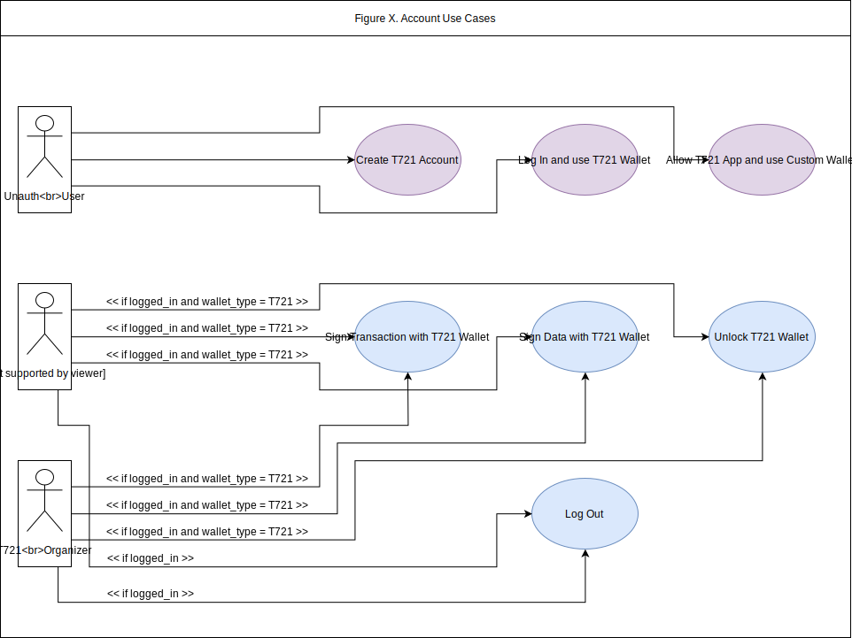

##### Example of Non-Critical Use Case Definition

|  | |
| :---: | :---: |
| Name | Log In and use T721 Wallet |
| Code | `T721AUC2` |
| Importance | Non-Critical |
| Primary Actor | Unauthenticated User |
| Preconditions | Unauthenticated User provides valid credentials |
| Postconditions | A Token and its encrypted Wallet is sent to the Unauthenticated User |

##### Example of Critical Use Case Definition

|  | |
| :---: | :---: |
| Name | Create T721 Account |
| Code | `T721AUC1` |
| Importance | Critical |
| Primary Actor | Unauthenticated User |
| Preconditions | User provides valid credentials |
| Postconditions | New T721 account is created with given credentials, a new Wallet is generated |

#### UI & UX Views 🖥

In our modern product process approach, we focus a lot more on external interfaces and user interactions. This is why we included what we are calling `UI Views`. In a hierarchical manner, each section of the website has its design captured. Two reasons for this :

- It's now easier for someone non-technical or someone new to the team to have a real overview of the interfaces and how all the use cases defined in the `Use Case View` or the Critical Scenarios are triggered.

- When modification are required, it is now trivial to show previous and future version, and creates less ambiguous results.

We also include an `UX View` for every `UI View`, that describes the nature of the elements present in the design, and captures key events and when they are triggered. This is very useful to keep consistent interfaces between mobile and desktop applications. Always associated with a Component Table that defines all the types of components that can be found on the `UX Views`.

##### Example of UI View

    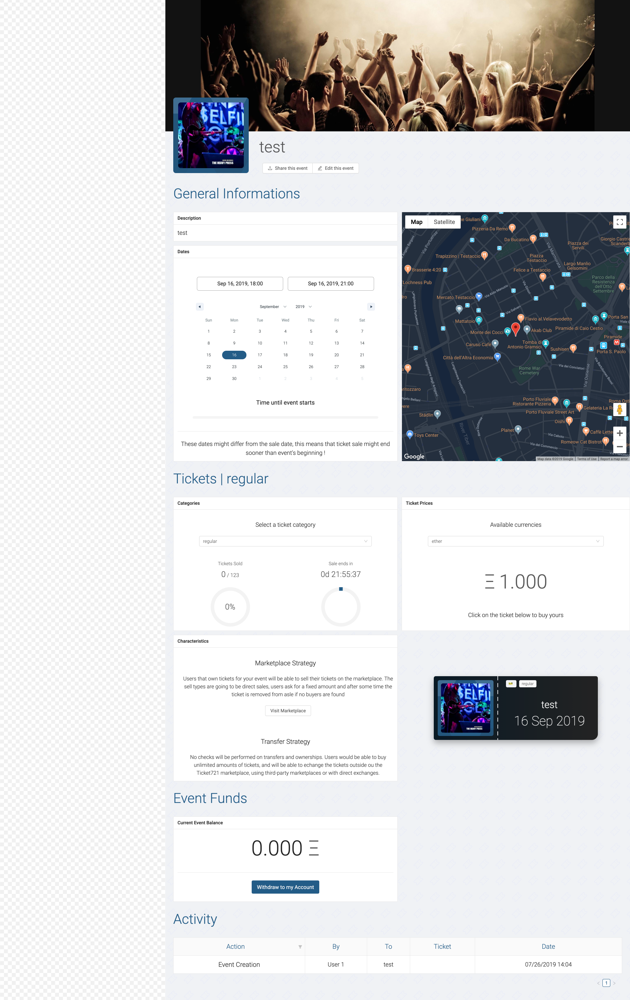

##### Example of Component Table

    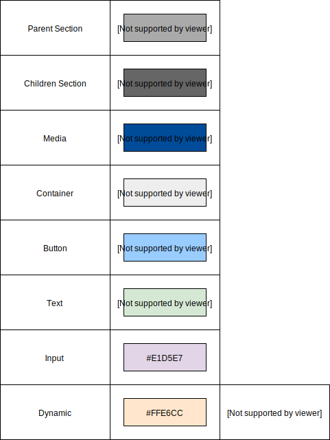

##### Example of UX View

    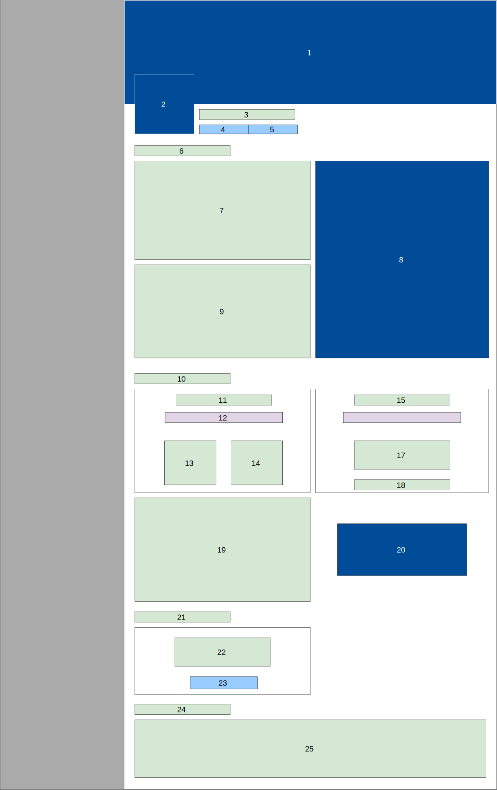

##### Example of UI & UX View description

|  | |
| :---: | :---: |
| Name | Event |
| Hierarchy | `UI1` > `events` > `UI5` > |
| Part of | `#desktop_web_app.UI10` |
| Unique ID | `#desktop_web_app.UI10` |
| Render Conditions | Event is selected in [Events Management Navigation (`UI5`)](#) |
| Type | UI Elements |
| --- | --- |
| `4` : on click | Copy Event URL to clipboard |
| `5` : on click | Enable Edit Mode, Navigates to [Edit Event (`UI11`)](#) |
| `20` : on click | Open [Buy Ticket from Event (`MUI1`)](#) |
| `23` : on click | Trigger [System Operation Contract 14 in Withdraw Event Funds (`CO14`)](#) |

#### Critical Scenarios ❗

Each `critical` Use Case is considered to be a Critical Scenario. This scenario is defined by two documents: the SSD (System Sequence Diagram) and the SOC (System Operation Contract). The SSD will defined all the operations between the User / Actor and the System in order for the Critical Scenario to be complete. The SSD will define several System Operations. For Each System Operation, a System Operation Contract will define all required `pre-conditions` and `post-conditions`. `pre-conditions` are conditions required by the calling Actor in order for the System Operation to work properly, the `post-conditions` are the conditions that should be met by the System in order for the Actor to consider the Operation to be complete.

##### Example of System Sequence Diagram

    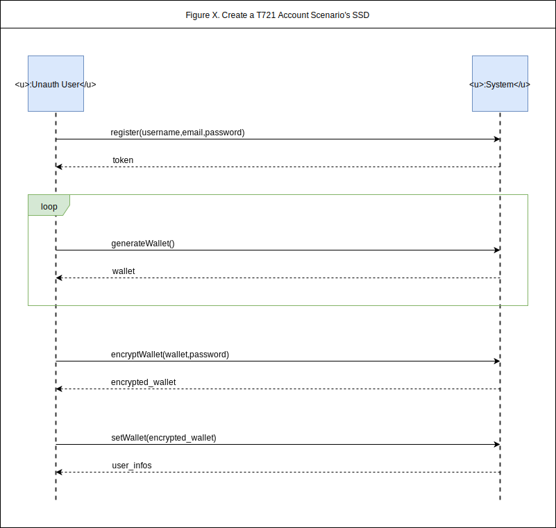

##### Example of System Operation Contract

|  | |
| :---: | :---: |
| Name | register(username, email, password) |
| Location | WebbApp, Server |
| Code | `CO1` |
| Preconditions | none |
| Postconditions | User instance `user` is created |
| | `user` email and username attributes are modified given `email`, `username` |
| | `user` password attribute is modified with hash of given `password` |
| | Token instance `token` is created |
| | `token` is associated to `user` |
| | `token` is returned |

#### Domain Model 🧩

Defines all the Actors en entities of our services. This is the reprensation of real-world actors, entities or concept, not software components. It pictures relations, no operations between them.

##### Example of Domain Model

    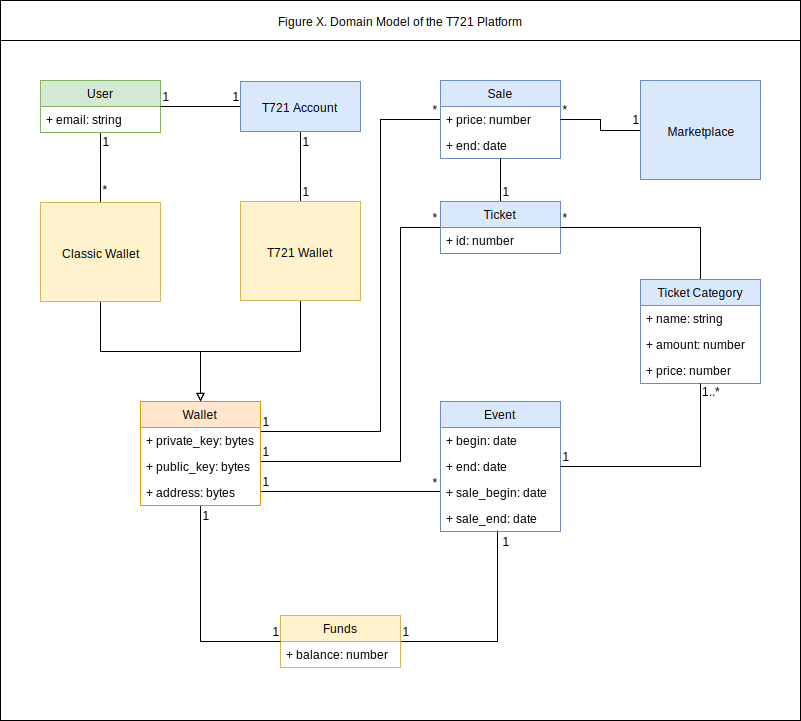

### Software Architecture Document 📗

This document goes deep into technical details. It is directly linked to the SRS and inherits some properties and sections defined there. It is composed of 7 Views, that define all the properties of the platform, and all of them should be edited according to current implementation. Adding a new field in a database table ? Edit the Data View. Changing the deployment configuration ? Edit the Dynamic View.

#### Logical View 💡

The Logical view presents all the tiers and layers of our system, and all the logical entities that are composing them. It provides a great overview of all the actors and interactions of the system, at a more technical level. It also describes all the use case realizations in details.

##### Example of Layer and Tiers Diagram

    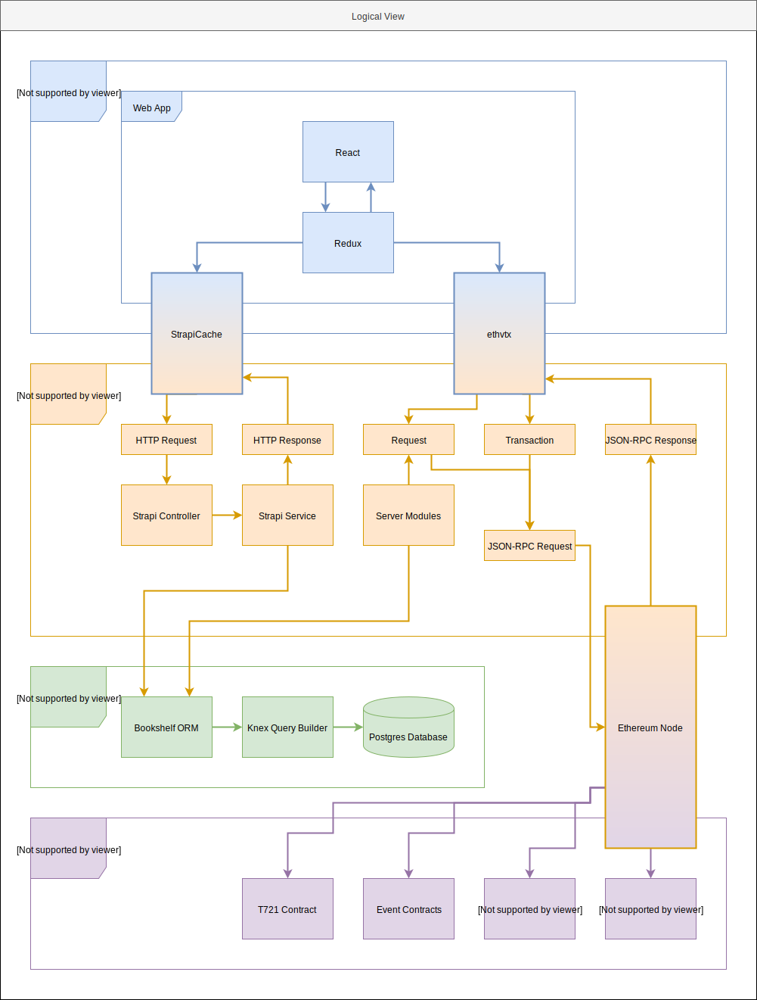

##### Example of Use Case Realization Diagram

    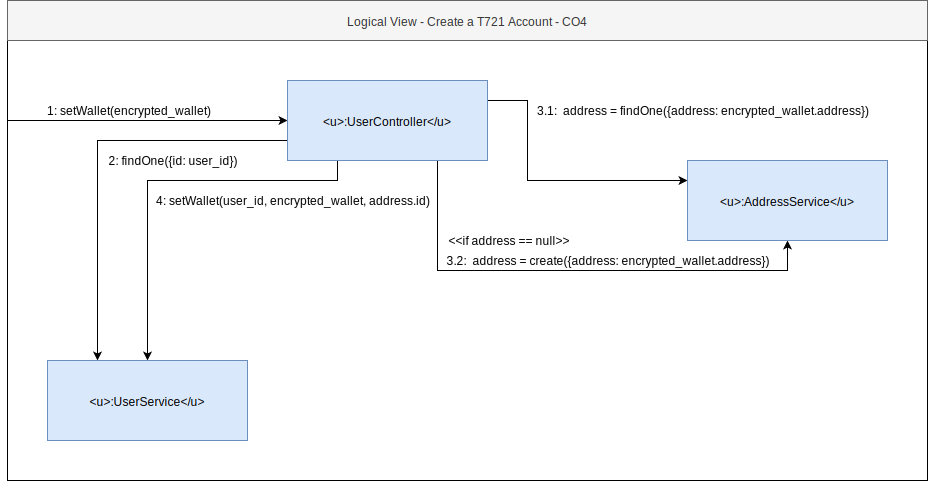

#### Process View 🔀

The Process view presents all the state shifting happening on the critical scenarios. It is composed of activity diagrams.

##### Example of Activity Diagram

    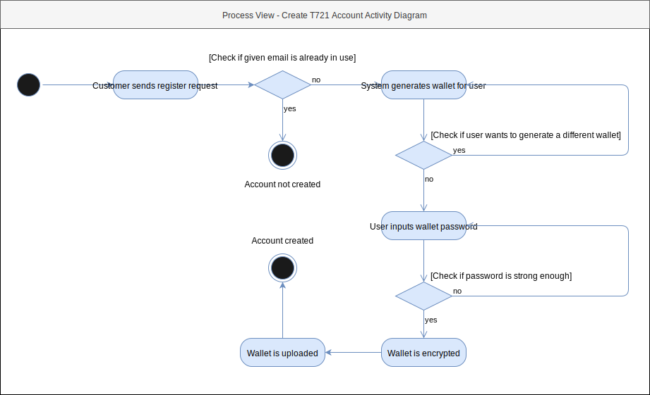

#### Implementation View 🛠

The Implementation view describes in details critical implementation sections.

##### Example of Implementation Diagram

    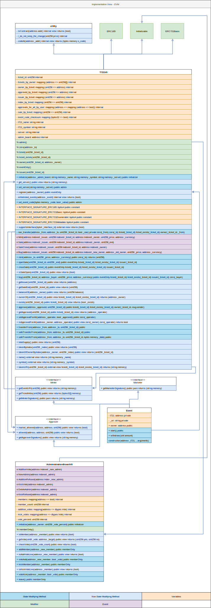

#### Data View 🗄

The Data view captures the organization and tables of the existing means of storage.

##### Example of Data Diagram

    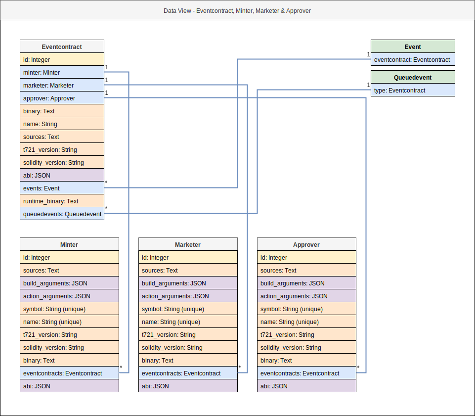

#### Deployment View 🚀 

The Deployment view captures the runtime infrastructure organization.

##### Example of Deployment Diagram

    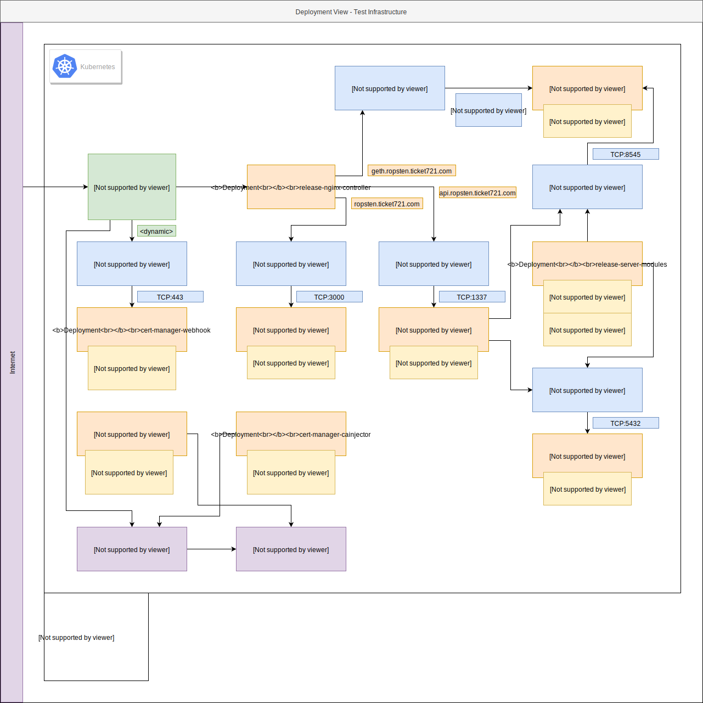

### Implementation Artifacts 📘

The Implementation Artifacts are the last type of documents. They are composed of all the code, the tests and the configs and there is only one rule: the code should reflect what is described in both the SRS and the SAD, nothing more, nothing less. As soon as a modification is made to the code, the SRS and SAD should be checked and modified accordingly (sometimes not required).

### Goal of the PS

The Product State is the composition of the 3 documents and artifacts collections described above: SRS, SAD and Implementation. They are tightly coupled and they should always be at the same level. There should be no code not documented in the SAD or SRS, there whould be no documentation of non-existing implementation.

## Product State Shifting Proposal (P2SP)

For most modifications of the Product State, a document called the P2SP should be created and completed. The main purpose is to document the sections that are modified, added or removed from all the different views of the SAD & SRS before starting any implementation. This process will ensure no ambiguous communication between technical and non-technical team. It will also store informations for a longer time and will always provide precise indications for the implementation part. Each P2SP will then be declined into one or several issues / PRs until the whole proposal is applied in the implementation, SRS and SAD.

### Composition

#### Title

The title should be a short sentence explaining what modifications are required.

#### Status

The status of the P2SP is one of the following:

- Sleeping: Document is not redacted yet
- Proposal To Fill: Document should be filled
- Waiting for reviews: Document is filled and assignees should review it
- Waiting for Implementation: Document is filled and reviewed, next step is the code 
- Implementing: Currently implementing modifications
- Waiting for Validations: Implementation is done, and reviewers should check the work
- Waiting for to be Merged: Work is done and should be merge to main branch
- Merged: P2SP is done

#### Description

Description should explain why the modifications are brought, in details.

#### Assignees

This is the following list of assignees:

- Main: The main assignee is in charge of the P2SP
- UI & UX: In charge of UI & UX View modification
- Use Case & Critical Scenarios: In Charge of Use Case View and Crtical Scenarios modifications
- Logical: In Charge of the Logical View modifications
- Process: In Charge of the Process View modifications
- Implementation: In Charge of the Implementation View modifications
- Data: In Charge of the Data View modifications
- Deployment: In Charge of the Deployment View modifications

Of course, not all P2SP require all the assignees.

#### View Updates

For any view modification, it should follow one of the following cases.

- Addition: New element is added and it should be mentionned new the diagram / text / table.
- Modification: Both old and new version of the modified artifacts should be included
- Removal: A list of removed artifacts should be provided

## Git

### Epics

### Issues

### Commits

### Branches

### PRs
