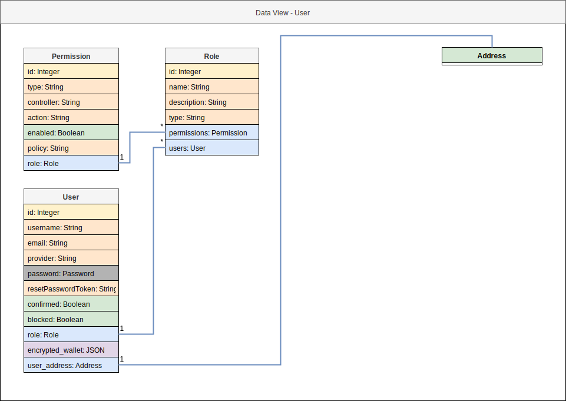

# Software Architecture Document 📗

     
    
     

| Version | Prepared By | Email |
| :---:   | :---:       | :---: |
| 1.0 | Iulian Rotaru | iulian.rotaru@ticket721.com |

## Document History

| Version | Date | Description | Author |
| :---:   | :---: | :---:      | :---:  |
| 1.0 | 02/08/2019 | Initial Documentation | Iulian Rotaru |

## Table of contents

1. [Introduction](#1_introduction)
    1. [Purpose](#1_1_purpose)
    2. [Scope](#1_2_scope)
    3. [Definitions, acronyms and abbreviations](1_3_definitions)
2. [Architectural representation](#2_architectural_representation)
    1. [Logical view 💡](#2_1_logical_view)
        1. [Layer and Tiers](#2_1_1_layer_and_tiers)
        2. [Use Case Realizations](#2_1_3_use_case_realizations)
    2. [Process view 🔀](#2_2_process_view)
    3. [Implementation view 🛠](#2_3_implementation_view)
        1. [EVM](#2_3_1_evm)
        1. [Companion App](#2_3_2_companion_app)
    4. [Data view 🗄](#2_4_data_view)
    5. [Deployment view 🚀](#2_5_deployment_view)
        1. [Test infrastructure](#2_5_1_test_infrastructure)
        
# 1. Introduction

The introduction of the Software Architecture Document will provide an overview of the document, will describe its purpose and its intended audience, and will describe all the technical or complicated terms that reader might find in it.

## 1.1. Purpose

The Software Architecture Document inherits from all the abstract definitions of the Software Requirements Specification and provides an in-depth definition of a set of perspectives of the system. The main goal of this document is to reduce the bus factor around the product, and ease onboarding of new developers by providing a complete and concise documentation of the product's composition. It should be updated whenever modifications are brought to the underlying implementation layer or to the overlying requirements documentation.

## 1.2. Scope

This document is targeting the technical members of the Product Team.

## 1.3. Definitions, acronyms and abbreviations

| Abbreviation | Description |
| :---:        | :---:       |
| `api`        | `application public inteface` |
| `T721` | Ticket721 |
| `Wallet` | A User's identity, that technically translates to a secret key owned entirely by the User |
| `T721 User` | User owning a Wallet and using User functions of the platform |
| `T721 Organizer` | User owning a Wallet and using Organizer functions of the platform (there are technically no differences between `T721 User` and `T721 Organizer`, we separate them by their Use Cases) |
| `Dapp` | Decentralized Application (in our case, using the Ethereum Virtual Machine) |

# 2. Architectural Representation

We are using the `5+1+2 Architecture`, a direct (and custom) modification of the `4+1 Architecture`.

    

## 2.1. Logical view 💡

### 2.1.1. Layers and Tiers

The following diagram defines the logical architecture of the system. The system follows a 4-tier architecture pattern with an extra EVM tier to represent the Ethereum Virtual Machine interactions.

    

### 2.1.2 Use case realizations

The following diagrams define in details the System Operation Contracts.

#### Create a T721 Account

    

    

    

    

#### Unlock T721 Wallet

    

#### Sign Transaction with T721 Wallet 

    

#### Sign Data with T721 Wallet 

    

#### Buy Ticket from Event 

    

#### Buy Ticket Sale 

    

#### Open Ticket Sale 

    

#### Close Ticket Sale 

    

#### Deploy Event

    

#### Start Event 

    

#### Withdraw Event Funds

    

#### Generate Ticket QR Codes

    

    

## 2.2. Process view 🔀

#### Create a T721 Account

    

#### Unlock T721 Wallet

    

#### Sign Transaction with T721 Wallet 

    

#### Sign Data with T721 Wallet 

    

#### Buy Ticket from Event 

    

#### Buy Ticket Sale

    

#### Open Ticket Sale

    

#### Close Ticket Sale

    

#### Deploy Event 

    

#### Start Event

    

#### Withdraw Event Funds

    

#### Generate Ticket QR Codes

    

## 2.3. Implementation view 🛠

### 2.3.1 EVM

    

### 2.3.2 Companion App

    

## 2.4. Data view 🗄

### Component Table

    

### Address

    

### Companion

    

### Event & Queuedevent

    

### Eventcontract, Minter, Marketer & Approver

    

### Utils

    

### Ticket

    

### Sale

    

### User

    

## 2.5. Deployment view 🚀

### 2.5.1. Test Infrastructure

    

