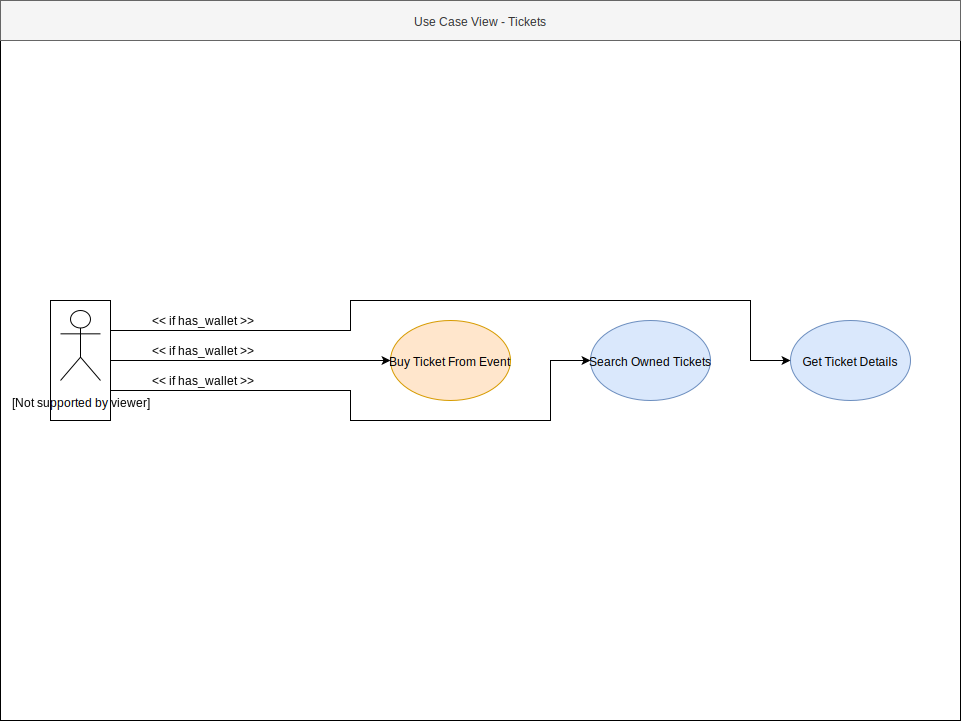
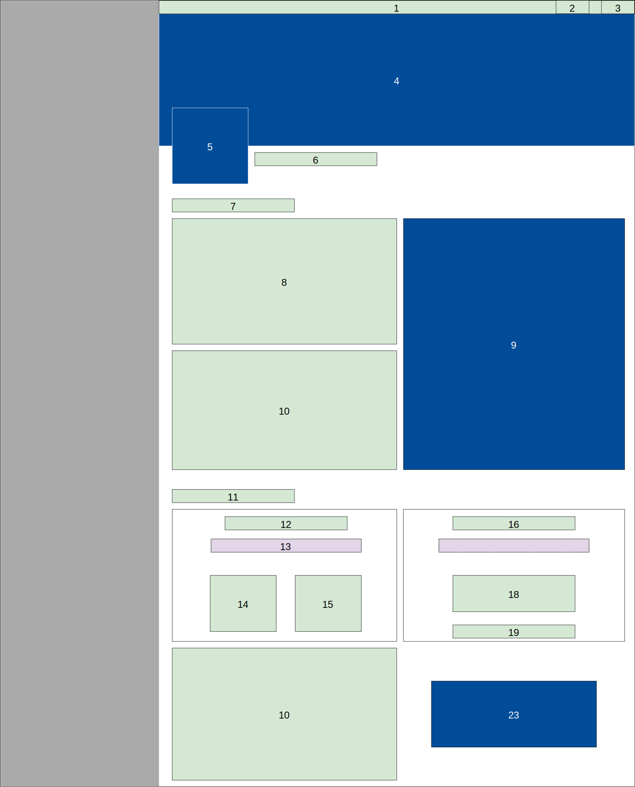
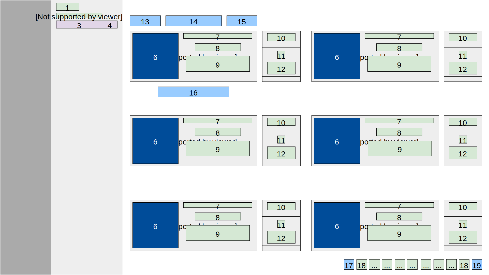
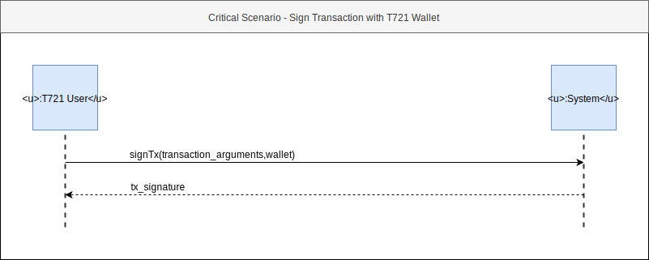

# Software Requirements Specification 📕

     
    
     

| Version | Prepared By | Email |
| :---:   | :---:       | :---: |
| 1.0 | Iulian Rotaru | iulian.rotaru@ticket721.com |

## Document History

| Version | Date | Description | Author |
| :---:   | :---: | :---:      | :---:  |
| 1.0 | 20/07/2019 | Initial Documentation | Iulian Rotaru |

## Table of contents

1. [Introduction](#1_introduction)
   1. [Purpose](#1_1_purpose)
   2. [Scope](#1_2_scope)
   3. [Definitions, acronyms and abbreviations](#1_3_definitions)
   4. [References](#1_4_references)
2. [Overall description](#2_overall_description)
   1. [Product perspective](#2_1_product_perspective)
   2. [Product functions](#2_2_product_functions)
   3. [User characteristics](#2_3_user_characteristics)
   4. [Constraints](#2_4_constraints)
   5. [Assumptions and dependencies](#2_5_assumptions)
3. [Specific requirements](#3_specific_requirements)
   1. [Functional requirements](#3_1_functional_requirements)
      1. [Actor goal list](#3_1_1_actor_goal_list)
      2. [Use case view ⭐️](#3_1_2_use_case_view)
   2. [Non-functional requirements](#3_2_non_functional_requirements)
      1. [Performance efficiency](#3_2_1_performance)
      2. [Compatibility](#3_2_2_compatibility)
      3. [Usability](#3_2_3_usability)
      4. [Reliability](#3_2_4_reliability)
      5. [Security](#3_2_5_security)
      6. [Maintainability](#3_2_6_maintainability)
      7. [Portability](#3_2_7_portability)
      8. [Design constraints](#3_2_8_design_constraints)
   3. [External interfaces](#3_3_external_interfaces)
      1. [UX & UI Views 🖥](#3_3_1_ux_ui_views)
4. [Analysis models](#4_analysis_model)
   1. [Critical Scenarios ❗️](#4_1_critical_scenarios)
      1. [Create a T721 Account](#4_1_1_create_t721_account)
      2. [Unlock T721 Wallet](#4_1_2_unlock_t721_wallet)
      3. [Sign Transaction with T721 Wallet](#4_1_3_sign_transaction_with_t721_wallet)
      4. [Sign Data with T721 Wallet](#4_1_4_sign_data_with_t721_wallet)
      5. [Buy Ticket From Event](#4_1_5_buy_ticket_from_event)
      6. [Buy Ticket Sale](#4_1_6_buy_ticket_sale)
      7. [Open Ticket Sale](#4_1_7_open_ticket_sale)
      8. [Close Ticket Sale](#4_1_8_open_ticket_sale)
      9. [Deploy Event](#4_1_9_deploy_event)
      10. [Start Event](#4_1_10_start_event)
      11. [Withdraw Event Funds](#4_1_11_withdraw_event_funds)
   2. [Domain Model 🧩](#4_2_domain_model)

# 1. Introduction

This document will provide an overview of the T721 Platform.

## 1.1. Purpose

An abstract description of the T721 Platform is required as a communication and coordination mean between the technical and non-technical teams. This overview provides enough information for one to understand the Platform and its functions without a deep technical knowledge.

## 1.2. Scope

This document is accessible by all the T721 team. Only technical and product team members might edit its content. The document can be shared to outside parties only under non-divulgation agreement.

## 1.3. Definitions, acronyms and abbreviations

| Abbreviation | Description |
| :---:        | :---:       |
| `api`        | `application public inteface` |
| `T721` | Ticket721 |
| `Wallet` | A User's identity, that technically translates to a secret key owned entirely by the User |
| `T721 User` | User owning a Wallet and using User functions of the platform |
| `T721 Organizer` | User owning a Wallet and using Organizer functions of the platform (there are technically no differences between `T721 User` and `T721 Organizer`, we separate them by their Use Cases` |
| `Dapp` | Decentralized Application (in our case, using the Ethereum Virtual Machine) |
| `SSD` | System Sequence Diagram |
| `SOC` | System Operation Contract |
| `UI` | User Interface |
| `UX` | User eXperience |

# 2. Overall description

    

## 2.1. Product perspective

    
     

The core functionalities of the platform are handled inside the **T721 Contracts**. They handle all the transactions, create Events, Tickets and Ticket Sales.

On our end, we manage the **T721 Server**, **T721 Server Modules** and **T721 Ethereum Node**. 

The **T721 Server** offers and `api` to `T721 Users` and `T721 Organizers`. This `api` handles data from the Ethereum Blockchain and converts it into database entries. The entries are then queried in a more flexible and useful way into the application.

The **T721 Server Modules** are constantly listening to the Ethereum Blockchain for Events happening to our set of Smart Contracts. One example of Event could be the creation of a Ticket, or a transfer of a Ticket etc ... All these Events are then registered into the database, and served to the `T721 User` and `T721 Organizer` from the **T721 Server**.

The **T721 Ethereum Node** is simply an instance of an Ethereum Client, that communicates witg hundreds / thousands of other clients to intercept and store transactions and actions happening on the Ethereum Blockchain.

Finally, the **T721 WebApp**, **T721 Companion App** and **T721 Scanner App** are interfaces to our platform.

The **T721 WebApp** is an application that serves as a direct communication mean between the **T721 Contracts** and the `T721 User` and `T721 Organizer`. From it, they can create and manage Events, Buy Tickets and sell them back on the Marketplace.

The **T721 Companion App** is a mobile application that helps `T721 Users` store the Tickets they own in an offline manner. The application is able to generate a proof of ownership that is dynamically changing and has the form of a QR Code.

The **T721 Scanner App** is another mobile application that helps `T721 Organizers` check the QR Codes generated by the **T721 Companion App**.

## 2.2. Product Functions

The product provides a web and mobile interface for events to deploy self hosted ticketing solutions. Anyone can deploy an Event under the form of a Smart Contract, that will sell Tickets depending on the rules chosen.

`T721 Users` can then buy these tickets, sell them back or exchange them in an extremelly secured manner, making it impossible to sell or exchange them outside of our platform.

The Marketplace makes the product unique by merging initial and secondary markets into the same platform, and providing a new revenue stream for Event Organizers.

## 2.3. User Characteristics

Two types of services are offered

- The `T721 User` is a user that owns a Wallet (either from a custom wallet provider like Metamask, Status, Opera ...) or uses the T721 Wallet. This type of User will buy tickets from Events, buy and sell tickets from the Marketplace and use the `Companion App` to generated the secured QR Codes. 

- The `T721 Organizer` is a user that owns a Wallet (either from a custom wallet provider like Metamask, Status, Opera ...) or uses the T721 Wallet. This type of User will create and manage Events, and will receive income from the tickets sold by its events, and from its tickets sold on the Marketplace.

## 2.4. Constraints

To use our service, a user does not have to create an account, but should be able to present himself with a valid Wallet. The Wallet will sign transactions and actions and this is how we will handle identity.

## 2.5. Assumption dependencies

Assuming that the system might be under various types of load, it should scale up and down to handle pressure and reduce costs. This includes the `T721 Server` and the `T721 Ethereum Node`.

# 3. Specific requirements

This section contains all requirements in detail: Functional as well as non-functional
requirements (quality attributes and constraints). The quality attributes are listed according
to the ISO/IEC 25010 standard that classifies software quality in a structured set of
characteristics and sub-characteristics.

## 3.1. Functional Requirements

Functional requirements capture the intended behaviour of the Cardea Services.

### 3.1.1. Actor Goal List

There are three types of Users:

- `Unauthenticated User`: A User that hasn't logged in its T721 Account if he uses the T721 Wallet or hasn't authorized our application in its Wallet if he uses a custom Wallet provider.
- `T721 User`: A User that has a Wallet ready to be used for specific use cases.
- `T721 Organizer`: A User that has a Wallet ready to be used for specific use cases that differ from the `T721 User`'s ones.

The `Minter`, `Marketer` and `Approver` are three module types for an Event. Each Event must have one of each in order to work properly. 

- The `Minter` is the module that handles the initial ticket creation rules (sale price, sale end, ticket amount ...)
- The `Marketer` is the module that handles the ticket sales between users.
- The `Approver` is the module that handles the ticket exchanges (outside of the Marketplace)

| Actor | Goal |
| :---: | :---: |
| `Unauthenticated User` | Create T721 Account |
| `Unauthenticated User` | Log In & Use T721 Wallet |
| `Unauthenticated User` | Allow T721 WebApplication & Use Custom Wallet |
| `T721 User` / `T721 Organizer` | Unlock T721 Wallet |
| `T721 User` / `T721 Organizer` | Sign Data with T721 Wallet |
| `T721 User` / `T721 Organizer` | Sign Transaction with T721 Wallet |
| `T721 User` / `T721 Organizer` | Log Out |
| `T721 User` | Search Events |
| `T721 User` | Get Event Details |
| `T721 User` | List Ticket Details of Event |
| `T721 User` | Buy Ticket from Event |
| `T721 User` | Search Owned Tickets |
| `T721 User` | Get Ticket Details |
| `T721 User` | Search Ticket Sales |
| `T721 User` | Open Ticket Sale |
| `T721 User` | Close Ticket Sale |
| `T721 User` | Buy Ticket Sale |
| `T721 Organizer` | Set Event Information |
| `T721 Organizer` | Set Event Minter |
| `T721 Organizer` | Set Event Marketer |
| `T721 Organizer` | Set Event Approver |
| `T721 Organizer` | Deploy Event |
| `T721 Organizer` | Start Event |
| `T721 Organizer` | Edit Event Information |
| `T721 Organizer` | Get Event Funds |
| `T721 Organizer` | Withdraw Event Funds |
| `T721 User` / `T721 Organizer` | Edit Username |

### 3.1.2. Use Case View ⭐

#### T721 Account (T721AUC)

    

|  | |
| :---: | :---: |
| Name | Create T721 Account |
| Code | `T721AUC1` |
| Importance | Critical |
| Primary Actor | Unauthenticated User |
| Preconditions | User provides valid credentials |
| Postconditions | New T721 account is created with given credentials, a new Wallet is generated |

|  | |
| :---: | :---: |
| Name | Log In and use T721 Wallet |
| Code | `T721AUC2` |
| Importance | Non-Critical |
| Primary Actor | Unauthenticated User |
| Preconditions | Unauthenticated User provides valid credentials |
| Postconditions | A Token and its encrypted Wallet is sent to the Unauthenticated User |

|  | |
| :---: | :---: |
| Name | Allow T721 WebApp and Use Custom Wallet |
| Code | `T721AUC3` |
| Importance | Non-Critical |
| Primary Actor | Unauthenticated User |
| Preconditions | Unauthenticated User uses a custom Wallet |
| Postconditions | When authorization is given, app uses provided Wallet to connect to Ethereum |

|  | |
| :---: | :---: |
| Name | Unlock T721 Wallet |
| Code | `T721AUC4` |
| Importance | Critical |
| Primary Actor | T721 User, T721 Organizer |
| Preconditions | T721 User / Organizer is logged in a T721 Account, T721 User / Organizer provides the correct password |
| Postconditions | T721 Wallet is unlocked |

|  | |
| :---: | :---: |
| Name | Sign Transaction with T721 Wallet |
| Code | `T721AUC5` |
| Importance | Critical |
| Primary Actor | T721 User, T721 Organizer |
| Preconditions | T721 User / Organizer is logged in a T721 Account, T721 Wallet is unlocked, transaction arguments are provided |
| Postconditions | A signed transaction is provided |

|  | |
| :---: | :---: |
| Name | Sign Data with T721 Wallet |
| Code | `T721AUC6` |
| Importance | Critical |
| Primary Actor | T721 User, T721 Organizer |
| Preconditions | T721 User / Organizer is logged in a T721 Account, T721 Wallet is unlocked, valid signable data is provided |
| Postconditions | A signature is provided |

|  | |
| :---: | :---: |
| Name | Log Out |
| Code | `T721AUC7` |
| Importance | Non-Critical |
| Primary Actor | T721 User, T721 Organizer |
| Preconditions | T721 User / Organizer is logged in a T721 Account |
| Postconditions | Previously provided token is unvalidated |

#### T721 Events (T721EUC)

    

|  | |
| :---: | :---: |
| Name | Search Events |
| Code | `T721EUC1` |
| Importance | Non-Critical |
| Primary Actor | T721 User |
| Preconditions | T721 User has provided a valid Wallet to the app, valid query parameters are provided |
| Postconditions | A List of Events is sent back to the T721 User, depending on the provided query parameters |

|  | |
| :---: | :---: |
| Name | Get Event Details |
| Code | `T721EUC2` |
| Importance | Non-Critical |
| Primary Actor | T721 User |
| Preconditions | T721 User has provided a valid Wallet to the app, Event exists |
| Postconditions | All informations about the Event are sent to the T721 User |

|  | |
| :---: | :---: |
| Name | List Ticket Details of Event |
| Code | `T721EUC3` |
| Importance | Non-Critical |
| Primary Actor | T721 User |
| Preconditions | T721 User has provided a valid Wallet to the app, Event exists |
| Postconditions | All Ticket types information are sent to the T721 User |

#### T721 Tickets (T721TUC)

    

|  | |
| :---: | :---: |
| Name | Buy Ticket from Event |
| Code | `T721TUC1` |
| Importance | Critical |
| Primary Actor | T721 User |
| Preconditions | T721 User has provided a valid Wallet to the app, T721 User Wallet has enough funds |
| Postconditions | A transaction to buy the specified Ticket is sent by the T721 User Wallet to the Ethereum Blockchain |

|  | |
| :---: | :---: |
| Name | Search Owned Tickets |
| Code | `T721TUC2` |
| Importance | Non-Critical |
| Primary Actor | T721 User |
| Preconditions | T721 User has provided a valid Wallet to the app, valid query parameters are provided |
| Postconditions | A list of owned Tickets is sent to the T721 User, depending on the provided query parameters |

|  | |
| :---: | :---: |
| Name | Get Ticket Details |
| Code | `T721TUC3` |
| Importance | Non-Critical |
| Primary Actor | T721 User |
| Preconditions | T721 User has provided a valid Wallet to the app, valid Ticket is provided |
| Postconditions | All information about the Ticket are sent to the T721 User |

#### T721 Marketplace (T721MUC)

    

|  | |
| :---: | :---: |
| Name | Search Ticket Sale |
| Code | `T721MUC1` |
| Importance | Non-Critical |
| Primary Actor | T721 User |
| Preconditions | T721 User has provided a valid Wallet to the app, valid query parameters are provided |
| Postconditions | A list of Ticket Sales is sent to the T721 User, depending on the provided query parameters |

|  | |
| :---: | :---: |
| Name | Buy Ticket Sale |
| Code | `T721MUC2` |
| Importance | Critical |
| Primary Actor | T721 User |
| Preconditions | T721 User has provided a valid Wallet to the app, T721 User Wallet has enough funds, Ticket Sale is not created by T721 User |
| Postconditions | A transaction to buy the specified Ticket Sale is sent by the T721 User Wallet to the Ethereum Blockchain |

|  | |
| :---: | :---: |
| Name | Open Ticket Sale |
| Code | `T721MUC3` |
| Importance | Critical |
| Primary Actor | T721 User |
| Preconditions | T721 User has provided a valid Wallet to the app, T721 User Wallet has enough funds, valid Ticket is provided, T721 User owns the Ticket, valid Sale parematers are provided |
| Postconditions | A transaction to open a new Ticket Sale is sent by the T721 User Wallet to the Ethereum Blockchain |

|  | |
| :---: | :---: |
| Name | Close Ticket Sale |
| Code | `T721MUC4` |
| Importance | Critical |
| Primary Actor | T721 User |
| Preconditions | T721 User has provided a valid Wallet to the app, T721 User Wallet has enough funds, Ticket Sale is created by T721 User |
| Postconditions | A transaction to close a Ticket Sale is sent by the T721 User Wallet to the Ethereum Blockchain |

#### T721 Event Creation (T721ECUC)

    

|  | |
| :---: | :---: |
| Name | Set Event Information |
| Code | `T721ECUC1` |
| Importance | Non-Critical |
| Primary Actor | T721 Organizer |
| Preconditions | T721 Organizer has provided a valid Wallet to the app, valid information is provided by the T721 Organizer |
| Postconditions | Given information is stored in the Event Creation Process |
 

|  | |
| :---: | :---: |
| Name | Set Event Minter |
| Code | `T721ECUC2` |
| Importance | Non-Critical |
| Primary Actor | T721 Organizer |
| Preconditions | T721 Organizer has provided a valid Wallet to the app, valid Minter is selected, valid Minter parameters are provided |
| Postconditions | Given Minter and parameters are stored in the Event Creation Process |

|  | |
| :---: | :---: |
| Name | Set Event Marketer |
| Code | `T721ECUC3` |
| Importance | Non-Critical |
| Primary Actor | T721 Organizer |
| Preconditions | T721 Organizer has provided a valid Wallet to the app, valid Marketer is selected, valid Marketer parameters are provided |
| Postconditions | Given Marketer and parameters are stored in the Event Creation Process |

|  | |
| :---: | :---: |
| Name | Set Event Approver |
| Code | `T721ECUC4` |
| Importance | Non-Critical |
| Primary Actor | T721 Organizer |
| Preconditions | T721 Organizer has provided a valid Wallet to the app, valid Approver is selected, valid Approver parameters are provided |
| Postconditions | Given Approver and parameters are stored in the Event Creation Process |

|  | |
| :---: | :---: |
| Name | Deploy Event |
| Code | `T721ECUC5` |
| Importance | Critical |
| Primary Actor | T721 Organizer |
| Preconditions | T721 Organizer has provided a valid Wallet to the app, T721 Organizer Wallet has enough funds, valid informations is provided, valid Minter is selected and configured, valid Marketer is selected and configured, valid Approver is selected and configured |
| Postconditions | A transaction to deploy a new Event is sent by the T721 Organizer Wallet to the Ethereum Blockchain |

|  | |
| :---: | :---: |
| Name | Start Event |
| Code | `T721ECUC6` |
| Importance | Critical |
| Primary Actor | T721 Organizer |
| Preconditions | T721 Organizer has provided a valid Wallet to the app, T721 Organizer Wallet has enough funds, T721 Organizer is owner of Event |
| Postconditions | A transaction to start the Event is sent by the T721 Organizer Wallet to the Ethereum Blockchain |

#### T721 Event Management (T721EMUC)

    

|  | |
| :---: | :---: |
| Name | Edit Event Information |
| Code | `T721EMUC1` |
| Importance | Non-Critical |
| Primary Actor | T721 Organizer |
| Preconditions | T721 Organizer has provided a valid Wallet to the app, valid information is provided, T721 Organizer is owner of Event, valid Wallet signature is provided |
| Postconditions | Event information is modified |

|  | |
| :---: | :---: |
| Name | Get Event Funds |
| Code | `T721EMUC2` |
| Importance | Non-Critical |
| Primary Actor | T721 Organizer |
| Preconditions | T721 Organizer has provided a valid Wallet to the app, valid information is provided |
| Postconditions | Current Event balance value is sent to the T721 Organizer |

|  | |
| :---: | :---: |
| Name | Withdraw Event Funds |
| Code | `T721EMUC3` |
| Importance | Critical |
| Primary Actor | T721 Organizer |
| Preconditions | T721 Organizer has provided a valid Wallet to the app, T721 Organizer is owner of Event |
| Postconditions | A transaction to withdraw the Event Funds is sent by the T721 Organizer Wallet to the Ethereum Blockchain |

#### T721 Settings (T721SUC)

    

|  | |
| :---: | :---: |
| Name | Edit Username |
| Code | `T721SUC1` |
| Importance | Non-Critical |
| Primary Actor | T721 User, T721 Organizer |
| Preconditions | T721 User / Organizer has provided a valid Wallet to the app, T721 User / Organizer has provided a valid signature of the new username |
| Postconditions | The username is modified |

## 3.2. Non-Functional Requirements

### 3.2.1. Performance efficiency

The `T721 Server`, `T721 Database` and `T721 Ethereum Node` should be able to scale properly.

### 3.2.2. Compatibility

The platform uses the ERC721 (NFT) protocol to create and operate tickets. Any external service can plus itself to our contracts and interact with the tickets.

### 3.2.3. Usability

The `T721 WebApp` should be usable on Desktop and Mobile. The `T721 Companion` and `T721 Scanner` should be usable on iOS and Android devices.

### 3.2.4. Reliability

The `T721 Platform` handles the transactions that are sent to the Ethereum Blockchain. As soon as the transaction leaves the Platform to go on the Blockchain, it is not our reponsibility to make it proceed.
Event if our platform is shut down, our database is compromised and erased, all the Events and Tickets should still exist.

### 3.2.5. Security

The T721 Wallet is stored in an encrypted manner on our `T721 Database`.

### 3.3.6. Portability

No specific portability requirements.

### 3.2.7. Design Constraints

The main goal of the T721 Platform is to think UX before anything else and provide an easy to use interface to our `T721 Contracts`.

## 3.3. External interfaces

#### Graphical External Interfaces

- **T721 WebApp** is a web application that communicates both with the Ethereum Blockchain and the `T721 Server`. Most use cases happend through it.
- **T721 Companion** is a mobile application that stores Tickets in an offline manner and is able to generate signed QR Codes.
- **T721 Scanner** is a mobile application that is able to verify the signed QR Codes. 

#### Non-graphical Interfaces

- **T721 Server** exposes an `api` used by the **T721 WebApp**, **T721 Companion** and **T721 Scanner**.
- **T721 Contracts** exposes read-only methods and helpers.

### 3.3.1. UX & UI Views 🖥

`UI Views` capture the intended design of every part of the platform, while the `UX Views` capture the intended layout and usability of them.

#### UX Components Cheatsheet

    

#### Hierarchical Overview

This overview shows how views are organized on the `desktop_web_app` and `mobile_web_app`.

---
- [`desktop_web_app`](#desktop_web_app)
    - [Main Navigation (`UI1`)](#desktop_web_app.UI1)
        - [Provider Selection (`UI2`)](#desktop_web_app.UI2)
        - [T721 Login Form (`UI3`)](#desktop_web_app.UI3)
        - [T721 Register Form (`UI4`)](#desktop_web_app.UI4)
        - [T721 Wallet Creation (`UI22)](#desktop_web_app.UI22)
        - [`/events`](#desktop_web_app./events)
            - [Events Management Navigation (`UI5`)](#desktop_web_app.UI5)
                - [Event Creation](#desktop_web_app.event_creation)
                    - [Event Informations Form (`UI6`)](#desktop_web_app.UI6)
                    - [Event Minter Form (`UI7`)](#desktop_web_app.UI7)
                    - [Event Marketer Form (`UI8`)](#desktop_web_app.UI8)
                    - [Event Approver Form (`UI9`)](#desktop_web_app.UI9)
                - [Event (`UI10`)](#desktop_web_app.UI10)
                    - [Edit Event (`UI11`)](#desktop_web_app.UI11)
                - [QueuedEvent (`UI12`)](#desktop_web_app.UI12)
                    - [Edit QueudEvent (`UI13`)](#desktop_web_app.UI13)
        - [`/`](#desktop_web_app./)
            - [Event List (`UI14`)](#desktop_web_app.UI14)
                - [Event List Filter (`UI15`)](#desktop_web_app.UI15)
        - [`/event`](#desktop_web_app./event)
            - [Event Page (`UI16`)](#desktop_web_app.UI16)
        - [`/marketplace`](#desktop_web_app./marketplace)
            - [Marketplace (`UI17`)](#desktop_web_app.UI17)
        - [`/account`](#desktop_web_app./account)
            - [Account Navigation (`UI18`)](#desktop_web_app.UI18)
                - [Owned Ticket List (`UI19`)](#desktop_web_app.UI19)
                - [User Settings (`UI20`)](#desktop_web_app.UI20)
        - [`/ticket`](#desktop_web_app./ticket)
            - [Ticket Details (`UI21`)](#desktop_web_app.UI21)
    - [`modals`](#desktop_web_app.modals)
        - [Buy Ticket From Event (`MUI1`)](#desktop_web_app.MUI1)
        - [Event Deployment (`MUI2`)](#desktop_web_app.MUI2)
        - [Marketplace Ticket Sale Purchase (`MUI3`)](#desktop_web_app.MUI3)
        - [Marketplace Ticket Sale Creation (`MUI4`)](#desktop_web_app.MUI4)
        - [Marketplace Ticket Sale Closing (`MUI5`)](#desktop_web_app.MUI5)
        - [T721 Wallet Unlock (`MUI6`)](#desktop_web_app.MUI6)
        - [T721 Wallet Sign Data (`MUI7`)](#desktop_web_app.MUI7)
        - [T721 Wallet Sign Transaction (`MUI8`)](#desktop_web_app.MUI8)
- [`mobile_web_app`](#mobile_web_app)
    - [Support Warning (`UI1`)](#mobile_web_app.UI1)
    
---

### `desktop_web_app`

### Depth 1 | Main Navigation (`UI1`)

    
    

|  | |
| :---: | :---: |
| Name | Locked Main Navigation |
| Hierarchy | `none` |
| Part of | `#desktop_web_app.UI1` |
| Unique ID | `#desktop_web_app.UI1.locked` |
| Render Conditions | No Wallet Provider selected |
| Type | UI Elements |
| --- | ---|
| `1` : on click | Navigates to [`/`](#desktop_web_app./) |

---

    
    

|  | |
| :---: | :---: |
| Name | Main Navigation |
| Hierarchy | `none` |
| Part of | `#desktop_web_app.UI1` |
| Unique ID | `#desktop_web_app.UI1.unlocked` |
| Render Conditions | `none` |
| Type | UI Elements |
| --- | ---|
| `1` : on click | Navigates to [`/`](#desktop_web_app./) |
| `2` : on click | Navigates to [`/`](#desktop_web_app./) |
| `3` : on click | Navigates to [`/marketplace`](#desktop_web_app./marketplace) |
| `4` : on click | Navigates to [`/events`](#desktop_web_app./events) |
| `5` : on click | Navigates to [`/account`](#desktop_web_app./account) |
| `6` : on click | Clear current Wallet Provider selection |
| `7` : on click | Collapses NavBar |

### Depth 2 | `UI1` > Provider Selection (`UI2`)

    
    

|  | |
| :---: | :---: |
| Name | Provider Selection |
| Hierarchy | `UI1` >  |
| Part of | `#desktop_web_app.UI2` |
| Unique ID | `#desktop_web_app.UI2` |
| Render Conditions | No Wallet Provider selected |
| Type | UI Elements |
| --- | ---|
| `5` : on click |  Select Custom Wallet as Wallet Provider |
| `9` : on click |  Select T721 Wallet as Wallet Provider |

### Depth 2 | `UI1` > T721 Login (`UI3`)

    
    

|  | |
| :---: | :---: |
| Name | T721 Login |
| Hierarchy | `UI1` > |
| Part of | `#desktop_web_app.UI3` |
| Unique ID | `#desktop_web_app.UI3` |
| Render Conditions | T721 Wallet Provider Selected |
| | User is not authenticated |
| Type | UI Elements |
| --- | ---|
| `4` : on click | Enables Remember Me |
| `5` : on click | `none` |
| `6` : on click | Trigger [Use Case Login and use T721 Wallet `T721AUC2`](#T721AUC2) |
| `7` : on click | Navigates to [T721 Register (`UI4`)](#desktop_web_app.UI4) |

### Depth 2 | `UI1` > T721 Register (`UI4`)

    
    

|  | |
| :---: | :---: |
| Name | T721 Register |
| Hierarchy | `UI1` > |
| Part of | `#desktop_web_app.UI4` |
| Unique ID | `#desktop_web_app.UI4` |
| Render Conditions | T721 Wallet Provider Selected |
| | User is not authenticated |
| Type | UI Elements |
| --- | ---|
| `5` : on click | Accept License Agreements |
| `6` : on click | Trigger [System Operation Contract 1 in Create T721 Account (`CO1`)](#CO1) |
| `7` : on click | Navigates to [T721 Login (`UI3`)](#desktop_web_app.UI3) |

### Depth 2 | `UI1` > T721 Wallet Creation (`UI22`)

    
    

|  | |
| :---: | :---: |
| Name | T721 Wallet Creation |
| Hierarchy | `UI1` > |
| Part of | `#desktop_web_app.UI22` |
| Unique ID | `#desktop_web_app.UI22` |
| Render Conditions | T721 Wallet Provider Selected |
| | User is authenticated |
| | User has no T721 Wallet |
| Type | UI Elements |
| --- | ---|
| `4` : on click | Trigger [System Operation Contract 2 in Create T721 Account (`CO2`)](#CO2) |
| `8` : on click | Trigger [System Operation Contract 4 in Create T721 Account (`CO4`)](#CO4) |

### Depth 2 | `UI1` > `/events`

|  | |
| :---: | :---: |
| Name | Events Management Page |
| Hierarchy | `UI1` > |
| Type | URL Path |

### Depth 3 | `/events` > Events Management Navigation (`UI5`)

    
    

|  | |
| :---: | :---: |
| Name | Events Management Navigation |
| Hierarchy | `UI1` > `/events` > |
| Part of | `#desktop_web_app.UI5` |
| Unique ID | `#desktop_web_app.UI5` |
| Render Conditions | `none` |
| Type | UI Elements |
| --- | ---|
| `1` : on click | Select Event Creation Process |
| `2` : amount | 0 => * |
| `2` : on click | Select Owned QueuedEvent |
| `3` : amount | 0 => * |
| `3` : on click | Select Owned Event |

### Depth 4 | `UI5` > Event Creation

|  | |
| :---: | :---: |
| Name | Events Management Page |
| Hierarchy | `UI1` > `/events` > `UI5` > |
| Render Conditions | Event Creation process is selected in [Events Management Navigation (`UI5`)](#desktop_web_app.UI5) |
| Type | Group |
| Member | [Event Information Form (`UI6`)](#desktop_web_app.UI6) |
|  | [Event Minter Form (`UI7`)](#desktop_web_app.UI7) |
|  | [Event Marketer Form (`UI8`)](#desktop_web_app.UI8) |
|  | [Event Approver Form (`UI9`)](#desktop_web_app.UI9) |

### Depth 5 | `UI5` > Event Creation > Event Information Form (`UI6`)

|  | |
| :---: | :---: |
| Name | Event Information Form |
| Hierarchy | `UI1` > `/events` > `UI5` > Event Creation > |
| Part of | `#desktop_web_app.UI6` |
| Unique ID | `#desktop_web_app.UI6` |
| Render Conditions | `none` |
| Type | UI Elements |
| --- | --- |
| `24` : on click | Save Information & Navigate to [Event Minter Form (`UI7`)](#desktop_web_app.UI7)|

### Depth 5 | `UI5` > Event Creation > Event Minter Form (`UI7`)

    
    

|  | |
| :---: | :---: |
| Name | Event Minter Form |
| Hierarchy | `UI1` > `events` > `UI5` > Event Creation > |
| Part of | `#desktop_web_app.UI7` |
| Unique ID | `#desktop_web_app.UI7` |
| Render Conditions | Event Informations are filled |
| | User went to next step from [Event Information Form (`UI6`)](#desktop_web_app.UI6)|
| Type | UI Elements |
| --- | --- |
| `6` : on click | Save Minter Selection & Navigate to [Event Marketer Form (`UI8`)](#desktop_web_app.UI8)|
| `7` : on click | Save Minter Selection & Navigate to [Event Information Form (`UI6`)](#desktop_web_app.UI6)|

### Depth 5 | `UI5` > Event Creation > Event Marketer Form (`UI8`)

    
    

|  | |
| :---: | :---: |
| Name | Event Marketer Form |
| Hierarchy | `UI1` > `/events` > `UI5` > Event Creation > |
| Part of | `#desktop_web_app.UI8` |
| Unique ID | `#desktop_web_app.UI8` |
| Render Conditions | Event Informations are filled |
| | Event Minter is selected |
| | User went to next step from [Event Minter Form (`UI7`)](#desktop_web_app.UI7)|
| Type | UI Elements |
| --- | --- |
| `6` : on click | Save Marketer Selection & Navigate to [Event Approver Form (`UI9`)](#desktop_web_app.UI9)|
| `7` : on click | Save Marketer Selection & Navigate to [Event Minter Form (`UI7`)](#desktop_web_app.UI7)|

### Depth 5 | `UI5` > Event Creation > Event Approver Form (`UI9`)

    
    

|  | |
| :---: | :---: |
| Name | Event Approver Form |
| Hierarchy | `UI1` > `/events` > `UI5` > Event Creation >  |
| Part of | `#desktop_web_app.UI9` |
| Unique ID | `#desktop_web_app.UI9` |
| Render Conditions | Event Informations are filled |
| | Event Minter is selected |
| | Event Marketer is selected |
| | User went to next step from [Event Marketer Form (`UI8`)](#desktop_web_app.UI8)|
| Type | UI Elements |
| --- | --- |
| `6` : on click | Save Approver Selection & Open [Event Deployment (`MUI2`)](#desktop_web_app.MUI2)|
| `6` : on click | Save Approver Selection & navigate to [Event Marketer Form (`UI8`)](#desktop_web_app.UI8)|

### Depth 4 | `UI5` > Event (`UI10`)

    
    

|  | |
| :---: | :---: |
| Name | Event |
| Hierarchy | `UI1` > `events` > `UI5` > |
| Part of | `#desktop_web_app.UI10` |
| Unique ID | `#desktop_web_app.UI10` |
| Render Conditions | Event is selected in [Events Management Navigation (`UI5`)](#desktop_web_app.UI5) |
| Type | UI Elements |
| --- | --- |
| `4` : on click | Copy Event URL to clipboard |
| `5` : on click | Enable Edit Mode, Navigates to [Edit Event (`UI11`)](#desktop_web_app.UI11) |
| `20` : on click | Open [Buy Ticket from Event (`MUI1`)](#desktop_web_app.MUI1) |
| `23` : on click | Trigger [System Operation Contract 14 in Withdraw Event Funds (`CO14`)](#CO14) |

### Depth 5 | `UI10` > Edit Event (`UI11`)

    
    

|  | |
| :---: | :---: |
| Name | Edit Event |
| Hierarchy | `UI1` > `events` > `UI5` > `UI10` > |
| Part of | `#desktop_web_app.UI11` |
| Unique ID | `#desktop_web_app.UI11` |
| Render Conditions | Event edition is selected in [Event (`UI10`)](#desktop_web_app.UI10) |
| Type | UI Elements |
| --- | --- |
| `1` : on click | Cancel Edit Mode, Navigates back to [Event (`UI10`)](#desktop_web_app.UI10) |
| `17` : on click | Trigger [Use Case Edit Event Information (`T721EMUC`)](#T721EMUC) |

### Depth 4 | `UI5` > QueuedEvent (`UI12`)

|  | |
| :---: | :---: |
| Name | QueuedEvent |
| Hierarchy | `UI1` > `events` > `UI5` > |
| Part of | `#desktop_web_app.UI12` |
| Unique ID | `#desktop_web_app.UI12` |
| Render Conditions | QueuedEvent is selected in [Events Management Navigation (`UI5`)](#desktop_web_app.UI5) |
| Type | UI Elements |
| --- | --- |
| `2` : on click | Enable Edit Mode, Navigates to [Edit QueuedEvent (`UI13`)](#desktop_web_app.UI13) |
| `3` : on click | Trigger [System Operation Contract 13 in Start Event (`CO13`)](#CO13) |

### Depth 5 | `UI10` > Edit QueuedEvent (`UI13`)

    
    

|  | |
| :---: | :---: |
| Name | Edit QueuedEvent |
| Hierarchy | `UI1` > `events` > `UI5` > `UI11` > |
| Part of | `#desktop_web_app.UI13` |
| Unique ID | `#desktop_web_app.UI13` |
| Render Conditions | QueuedEvent edition is selected in [QueuedEvent (`UI12`)](#desktop_web_app.UI12) |
| Type | UI Elements |
| --- | --- |
| `1` : on click | Cancel Edit Mode, Navigates back to [QueudEvent (`UI12`)](#desktop_web_app.UI12) |
| `17` : on click | Trigger [Use Case Edit Event Information (`T721EMUC`)](#T721EMUC) |

### Depth 2 | `UI1` > `/`

|  | |
| :---: | :---: |
| Name | Home Page |
| Hierarchy | `UI1` > |
| Type | URL Path |

### Depth 3 | `/` > Event List (`UI14`)

    
    

|  | |
| :---: | :---: |
| Name | Event List |
| Hierarchy | `UI1` > `/` > |
| Part of | `#desktop_web_app.UI14` |
| Unique ID | `#desktop_web_app.UI14` |
| Render Conditions | `none` |
| Type | UI Elements |
| --- | --- |
| `3` : on click | Trigger [Use Case Search Events (`T721EUC1`)](#T721EUC1) |
| `4` : on click | Clear Search query, Trigger [Use Case Search Events (`T721EUC1`)](#T721EUC1) |
| `5` : on click | Opens [Event List Filters (`UI15`)](#desktop_web_app.UI15) |
| `11` : on click | Navigates to [Event (`UI10`)](#desktop_web_app.UI10) |
| `12` : on click | Navigates to [Marketplace (`UI17`)](#desktop_web_app.UI17) |
| `13` : on click | Navigates to Event Website |
| `14` : on click | Previous Page |
| `16` : on click | Next Page |

### Depth 4 | `UI14` > Event List Filters (`UI15`)

    
    

|  | |
| :---: | :---: |
| Name | Event List Filters |
| Hierarchy | `UI1` > `/` > `UI14` |
| Part of | `#desktop_web_app.UI15` |
| Unique ID | `#desktop_web_app.UI15` |
| Render Conditions | `none` |
| Type | UI Elements |
| --- | --- |
| `1` : on click | Close Filter Drawer |
| `3` : on click | Enable / Disabled Active Marketplace filter |
| `5` : on click | Apply Filter, Close Filter Drawer, Trigger [Use Case Search Events (`T721EUC1`)](#T721EUC1) |

### Depth 2 | `UI1` > `/event`

|  | |
| :---: | :---: |
| Name | Event Details Page |
| Hierarchy | `UI1` > |
| Type | URL Path |

### Depth 3 | `/event` > Event Details (`UI16`)

    
    

|  | |
| :---: | :---: |
| Name | Event Details |
| Hierarchy | `UI1` > `/event` > |
| Part of | `#desktop_web_app.UI16` |
| Unique ID | `#desktop_web_app.UI16` |
| Render Conditions | `none` |
| Type | UI Elements |
| --- | --- |
| `4` : on click | Copy Event URL to clipboard |
| `5` : on click | Enable Edit Mode, Navigates to [Edit Event (`UI11`)](#desktop_web_app.UI11) |
| `20` : on click | Open [Buy Ticket from Event (`MUI1`)](#desktop_web_app.MUI1) |
| `23` : on click | Trigger [System Operation Contract 14 in Withdraw Event Funds (`CO14`)](#CO14) |

### Depth 2 | `UI1` > `/marketplace`

|  | |
| :---: | :---: |
| Name | Marketplace Page |
| Hierarchy | `UI1` > |
| Type | URL Path |

### Depth 3 | `/marketplace` > Marketplace (`UI17`)

    
    

|  | |
| :---: | :---: |
| Name | Marketplace |
| Hierarchy | `UI1` > `/marketplace` > |
| Part of | `#desktop_web_app.UI17` |
| Unique ID | `#desktop_web_app.UI17` |
| Render Conditions | `none` |
| Type | UI Elements | 
| --- | --- |
| `3` : on input | Trigger [Use Case Search Ticket Sale (`T721MUC1`)](#T721MUC1)
| `4` : on input | Trigger [Use Case Search Ticket Sale (`T721MUC1`)](#T721MUC1)
| `5` : on hover | Display elements `13`, `14`, `15`, `16` |
| `13` : on click | Navigate to [Event Details (`UI16`)](#desktop_web_app,UI16) |
| `14` : on click | Navigate to [Marketplace (`UI17`)](#desktop_web_app.UI17) |
| `15` : on click | Navigate to [Ticket Details (`UI21`)](#desktop_web_app.UI21) |
| `16` : on click | Opens [Marketplace Ticket Sale Purchase (`MUI3`)](#desktop_web_app.MUI3) |
| `17` : on click | Previous Page |
| `19` : on click | Next Page |

### Depth 2 | `UI1` > `/account`

|  | |
| :---: | :---: |
| Name | Account Page |
| Hierarchy | `UI1` > |
| Type | URL Path |

### Depth 3 | `/account` > Account Navigation (`UI18`)

    
    

|  | |
| :---: | :---: |
| Name | Account Navigation |
| Hierarchy | `UI1` > `/account` > |
| Part of | `#desktop_web_app.UI18` |
| Unique ID | `#desktop_web_app.UI18` |
| Render Conditions | `none` |
| Type | UI Elements |
| --- | --- |
| `3` : on click | Change tab to [Owned Ticket List (`UI19`)](#desktop_web_app.UI19) |
| `4` : on click | Change tab to [Account Settings (`UI20`)](#desktop_web_app.UI20) |

### Depth 4 | `UI18` > Owned Ticket List (`UI19`)

    
    

|  | |
| :---: | :---: |
| Name | Owned Ticket List |
| Hierarchy | `UI1` > `/account` > `UI18` > |
| Part of | `#desktop_web_app.UI19` |
| Unique ID | `#desktop_web_app.UI19` |
| Render Conditions | Ticket List tab is selected in [Account Navigation (`UI18`)](#desktop_web_app.UI18) |
| Type | UI Elements |
| --- | --- |
| `1` : on click | Open filters |
| `5` : on hover | Display elements `9`, `10`, `11`, `12` |
| `9` : on click | Navigate to [Event Details (`UI16`)](#desktop_web_app,UI16) |
| `10` : on click | Navigate to [Marketplace (`UI17`)](#desktop_web_app.UI17) |
| `11` : on click | Navigate to [Ticket Details (`UI21`)](#desktop_web_app.UI21) |
| `12` : on click | Opens [Marketplace Ticket Sale Creation (`MUI4`)](#desktop_web_app.MUI4), or [Marketplace Ticket Sale Closing (`MUI5`)](#desktop_web_app.MUI5) |
| `13` : on click | Previous Page |
| `15` : on click | Next Page |

### Depth 4 | `UI18` > Account Settings (`UI20`)

    
    

|  | |
| :---: | :---: |
| Name | Account Settings |
| Hierarchy | `UI1` > `/account` > `UI18` > |
| Part of | `#desktop_web_app.UI20` |
| Unique ID | `#desktop_web_app.UI20` |
| Render Conditions | Settings tab is selected in [Account Navigation (`UI18`)](#desktop_web_app.UI18) |
| Type | UI Elements |
| --- | --- |
| `6` : on click | Trigger [Use Case Edit Username (`T721SUC1`)](#T721SUC1)|

### Depth 2 | `UI1` > `/ticket`

|  | |
| :---: | :---: |
| Name | Ticket Details Page |
| Hierarchy | `UI1` > |
| Type | URL Path |

### Depth 3 | `/ticket` > Ticket Details (`UI21`)

    
    

|  | |
| :---: | :---: |
| Name | Ticket Details |
| Hierarchy | `UI1` > `/ticket` > |
| Part of | `#desktop_web_app.UI21` |
| Unique ID | `#desktop_web_app.UI21` |
| Render Conditions | `none` |
| Type | UI Elements |
| --- | --- |
| `6` : on click | Navigates to [Event (`UI10`)](#desktop_web_app.UI10) |
| `7` : on click | Navigates to [Marketplace (`UI17`)](#desktop_web_app.UI17) |
| `8` : on click | Navigates to Event Website |
| `13` : on click | Navigate to [Event Details (`UI16`)](#desktop_web_app,UI16) |
| `14` : on click | Navigate to [Marketplace (`UI17`)](#desktop_web_app.UI17) |
| `15` : on click | Navigate to [Ticket Details (`UI21`)](#desktop_web_app.UI21) |
| `16` : on click | Opens [Marketplace Ticket Sale Purchase (`MUI3`)](#desktop_web_app.MUI3), [Marketplace Ticket Sale Creation (`MUI4`)](#desktop_web_app.MUI4), or [Marketplace Ticket Sale Closing (`MUI5`)](#desktop_web_app.MUI5) |

### `modals`

### Buy Ticket from Event (`MUI1`)

    
    

|  | |
| :---: | :---: |
| Name | Buy Ticket from Event |
| Hierarchy | `none` |
| Part of | `#desktop_web_app.MUI1` |
| Unique ID | `#desktop_web_app.MUI1.checkout` |
| Render Conditions | `none` |
| Type | Modal |
| --- | --- |
| `10` : on click | Cancel Purchase |
| `11` : on click | Trigger [System Operation Contract 8 from Buy Ticket from Event (`CO8`)](#CO8) |
| | Navigate to next Purchase Step : Buy Ticket from Event Progress |
| `12` : on click | Close Modal |

---

    
    

|  | |
| :---: | :---: |
| Name | Buy Ticket from Event Progress |
| Hierarchy | `none` |
| Part of | `#desktop_web_app.MUI1` |
| Unique ID | `#desktop_web_app.MUI1.waiting` |
| Render Conditions | `none` |
| Type | Modal |
| --- | --- |
| `10` : on click | Navigate to [Owned Ticket List (`UI19`)](#desktop_web_app.UI19) |
| `11` : on click | Close Modal |
| `12` | Disabled |
| `13` : on click | Close Modal |

### Event Deployment (`MUI2`)

    
    

|  | |
| :---: | :---: |
| Name | Event Deployment Summary |
| Hierarchy | `none` |
| Part of | `#desktop_web_app.MUI2` |
| Unique ID | `#desktop_web_app.MUI2.summary` |
| Render Conditions | `none` |
| Type | Modal |
| --- | --- |
| `3` : on click | Closes Modal |
| `4` : on click | Goes to next Deployment Step : Event Deployment Acknowledge |
| `5` : on click | Closes Modal |

---

    
    

|  | |
| :---: | :---: |
| Name | Event Deployment Acknowledge |
| Hierarchy | `none` |
| Part of | `#desktop_web_app.MUI2` |
| Unique ID | `#desktop_web_app.MUI2.acknowledge` |
| Render Conditions | `none` |
| Type | Modal |
| --- | --- |
| `4` : on click | Closes Modal |
| `5` : on click | Navigates to next Deployment Step : Event Deployment Start |
| `6` : on click | Closes Modal |

---

    
    

|  | |
| :---: | :---: |
| Name | Event Deployment Start |
| Hierarchy | `none` |
| Part of | `#desktop_web_app.MUI2` |
| Unique ID | `#desktop_web_app.MUI2.start` |
| Render Conditions | `none` |
| Type | Modal |
| --- | --- |
| `4` : on click | Trigger [System Operation Contract 12 in Deploy Event (`CO12`)](#CO12) |
| | Navigates to next Deployment Step, Event Deployment Waiting |
| `5` : on click | Closes Modal |
| `6` | Disabled |
| `7` : on click | Closes Modal |

---

    
    

|  | |
| :---: | :---: |
| Name | Event Deployment Waiting |
| Hierarchy | `none` |
| Part of | `#desktop_web_app.MUI2` |
| Unique ID | `#desktop_web_app.MUI2.waiting` |
| Render Conditions | `none` |
| Type | Modal |
| --- | --- |
| `4` : on click | Navigate to [QueuedEvent (`UI12`)](#desktop_web_app.UI12) |
| `5` : on click | Closes Modal |
| `6` | Disabled |
| `7` : on click | Closes Modal |

### Marketplace Ticket Sale Purchase (`MUI3`)

    
    

|  | |
| :---: | :---: |
| Name | Marketplace Ticket Sale Purchase Information |
| Hierarchy | `none` |
| Part of | `#desktop_web_app.MUI3` |
| Unique ID | `#desktop_web_app.MUI3.information` |
| Render Conditions | `none` |
| Type | Modal |
| --- | --- |
| `12` : on click | Trigger [System Operation Contract 9 from Buy Ticket Sale (`CO9`)](#CO9) |
| | Navigate to next Purchase step : Marketplace Ticket Sale Purchase Waiting |
| `13` : on click | Closes Modal |
| `14` : on click | Closes Modal |

---

    
    

|  | |
| :---: | :---: |
| Name | Marketplace Ticket Sale Purchase Waiting |
| Hierarchy | `none` |
| Part of | `#desktop_web_app.MUI3` |
| Unique ID | `#desktop_web_app.MUI3.waiting` |
| Render Conditions | `none` |
| Type | Modal |
| --- | --- |
| `4` : on click | Navigates to [Owned Ticket List (`UI19`)](#desktop_web_app.UI19) |
| `5` : on click | Closes Modal |
| `6` : on click | Closes Modal |

### Marketplace Ticket Sale Creation (`MUI4`)

    
    

|  | |
| :---: | :---: |
| Name | Marketplace Ticket Sale Creation Form |
| Hierarchy | `none` |
| Part of | `#desktop_web_app.MUI4` |
| Unique ID | `#desktop_web_app.MUI4.form` |
| Render Conditions | `none` |
| Type | Modal |
| --- | --- |
| `10` : on click | Previous Form Page |
| `11` : on click | Next Form Page or Trigger [System Operation Contract 10 from Open Ticket Sale (`CO10`)](#CO10) |
| `12` : on click | Closes Modal |
| `13` : on click | Closes Modal |

---

    
    

|  | |
| :---: | :---: |
| Name | Marketplace Ticket Sale Creation Waiting |
| Hierarchy | `none` |
| Part of | `#desktop_web_app.MUI4` |
| Unique ID | `#desktop_web_app.MUI4.waiting` |
| Render Conditions | `none` |
| Type | Modal |
| `10` : on click | Navigates to [Marketplace (`UI17`)](#desktop_web_app.UI17) |
| `11` : on click | Closes Modal |
| `12` : on click | Closes Modal |

### Marketplace Ticket Sale Closing (`MUI5`)

    
    

|  | |
| :---: | :---: |
| Name | Marketplace Ticket Sale Closing Information |
| Hierarchy | `none` |
| Part of | `#desktop_web_app.MUI5` |
| Unique ID | `#desktop_web_app.MUI5.information` |
| Render Conditions | `none` |
| Type | Modal |
| --- | --- |
| `10` : on click | Trigger [System Operation Contract 11 Close Ticket Sale](#CO11) |
| `11` : on click | Closes Modal |
| `12` : on click | Closes Modal |

---

    
    

|  | |
| :---: | :---: |
| Name | Marketplace Ticket Sale Closing Waiting |
| Hierarchy | `none` |
| Part of | `#desktop_web_app.MUI5` |
| Unique ID | `#desktop_web_app.MUI5.waiting` |
| Render Conditions | `none` |
| Type | Modal |
| --- | --- |
| `4` : on click | Navigates to [Owned Ticket List (`UI19`)](#desktop_web_app.UI19) |
| `5` : on click | Closes Modal |
| `6` : on click | Closes Modal |

### T721 Wallet Unlock (`MUI6`)

    
    

|  | |
| :---: | :---: |
| Name | T721 Wallet Unlock |
| Hierarchy | `none` |
| Part of | `#desktop_web_app.MUI6` |
| Unique ID | `#desktop_web_app.MUI6` |
| Render Conditions | Data Signature or Transaction Signature is requested |
|| Wallet is Locked |
| Type | Modal |
| --- | --- |
| `4` : on click | Closes Modal |
| `5` : on click | Trigger [System Operation Contract 5 Unlock T721 Wallet (`CO5`)](#CO5)|
| `6` : on click | Closes Modal |

### T721 Wallet Sign Data (`MUI7`)

    
    

|  | |
| :---: | :---: |
| Name | T721 Wallet Sign Data |
| Hierarchy | `none` |
| Part of | `#desktop_web_app.MUI7` |
| Unique ID | `#desktop_web_app.MUI7` |
| Render Conditions | Data Signature is requested |
| Type | Modal |
| --- | --- |
| `5` : on click | Previous Data / Transaction signature request |
| `7` : on click | Next Data / Transaction signature request |
| `8` : on click | Closes Modal |
| `9` : on click | Trigger [System Operation Contract 7 Sign Data with T721 Wallet (`CO7`)](#CO7) |
| `10` : on click | Closes Modal |

### T721 Wallet Sign Transaction (`MUI8`)

    
    

|  | |
| :---: | :---: |
| Name | T721 Wallet Sign Transaction |
| Hierarchy | `none` |
| Part of | `#desktop_web_app.MUI8` |
| Unique ID | `#desktop_web_app.MUI8` |
| Render Conditions | Transaction Signature is requested |
| Type | Modal |
| --- | --- |
| `3` : on click | Previous Data / Transaction signature request |
| `5` : on click | Next Data / Transaction signature request |
| `6` : on click | Closes Modal |
| `7` : on click | Trigger [System Operation Contract 6 Sign Transaction with T721 Wallet (`CO6`)](#CO6) |
| `8` : on click | Closes Modal |

---
---
---

### `mobile_web_app`

#### Depth 1 | Support Warning (`UI1`)

    
    

|  | |
| :---: | :---: |
| Name | Mobile Support Warning |
| Hierarchy | `none` |
| Part of | `#mobile_web_app.UI1` |
| Unique ID | `#mobile_web_app.UI1.support_warning` |

# 4. Analysis Model

## 4.1. Critical Scenarios ❗

Critical Scenarios are sets of actions between the various types of Users and the System. They are defined in details with the help of the SSD and the SOC.

### 4.1.1 Create a T721 Account

In the case where our User is not using a custom Wallet like Tokenary, Coinbase Wallet, Status ..., he will need to setup its T721 Account to create and manage transactions. After creating the account on the server, the User will be able to generate a Wallet on the WebApp, encrypt it and send it encrypted to the server. Upon any login, this encrypted Wallet will be fetched for the User.
When the User has the `token` and the `encrypted_wallet` entities, he is considered as a `T721 User` or `T721 Organizer`.

#### System Sequence Diagram

    

#### System Operation Contract

|  | |
| :---: | :---: |
| Name | register(username, email, password) |
| Location | WebbApp, Server |
| Code | `CO1` |
| Preconditions | none |
| Postconditions | User instance `user` is created |
| | `user` email and username attributes are modified given `email`, `username` |
| | `user` password attribute is modified with hash of given `password` |
| | Token instance `token` is created |
| | `token` is associated to `user` |
| | `token` is returned |

|  | |
| :---: | :---: |
| Name | generateWallet() |
| Location | WebbApp |
| Code | `CO2` |
| Preconditions | none |
| Postconditions | Wallet instance `wallet` is created |
| | `wallet` is returned |

|  | |
| :---: | :---: |
| Name | encryptWallet(wallet, password) |
| Location | WebbApp |
| Code | `CO3` |
| Preconditions | Valid `wallet` is provided |
| Postconditions  | Buffer instance `encrypted_wallet` is created |
| | `encrypted_wallet` is set to the encryption result of `wallet` with `password` |
| | `encrypted_wallet` is returned |

|  | |
| :---: | :---: |
| Name | setWallet(encrypted_wallet) |
| Location | WebbApp, Server |
| Code | `CO4` |
| Preconditions | Valid `token` is provided | 
| | Valid `encrypted_wallet` is provided |
| Postconditions  | User instance `user` is recovered|
| | `user` attribute `encrypted_wallet` is modified to given `encrypted_wallet` |

### 4.1.2 Unlock T721 Wallet 

Upon any login, the encrypted wallet that was previously created will be fetched from the server and stored in an encrypted manner. As soon as an action requiring the wallet to make signatures or encryptions is required, the encrypted wallet should be decrypted.

#### System Sequence Diagram

    

#### System Operation Contract

|  | |
| :---: | :---: |
| Name | unlockWallet(encrypted_wallet, password) |
| Location | WebbApp |
| Code | `CO5` |
| Preconditions | Valid `encrypted_wallet` is provided |
| | Valid `password` is provided|
| Postconditions | Wallet instance `wallet` is created |
| | `wallet` is set to the decryption result of `encrypted_wallet` with `password` |
| | `wallet` is returned |

### 4.1.3 Sign Transaction with T721 Wallet 

When using the T721 Wallet, there is no outside Wallet like Metamask to provide the signatures. In order to keep a similar flow of action between T721 Users with a T721 Wallet and a Custom Wallet, the T721 Wallet will provide the exact same signed output as the Custom Wallets. When requesting a new transaction, the app should use the wallet to sign it and prove the T721 User consent.

#### System Sequence Diagram

    

#### System Operation Contract

|  | |
| :---: | :---: |
| Name | signTx(transaction_arguments, wallet) |
| Location | WebbApp |
| Code | `CO6` |
| Preconditions | Valid `transaction_arguments` is provided. Valid `wallet` is provided|
| Postconditions | Signature instance `tx_signature` is created |
| | `tx_signature` is set to the signature of the `transaction_arguments` |

### 4.1.4 Sign Data with T721 Wallet 

When requesting a new data signature, the app should use the wallet to sign it and prove the T721 User consent.

#### System Sequence Diagram

    

#### System Operation Contract

|  | |
| :---: | :---: |
| Name | sign(data, wallet) |
| Location | WebbApp |
| Code | `CO7` |
| Preconditions | Valid `data` is provided. Valid `wallet` is provided|
| Postconditions | Signature instance `data_signature` is created |
| | `data_signature` is set to the signature of the `data` |

### 4.1.5 Buy Ticket from Event 

Buying a Ticket starts by signing a transaction, this signed payload is then broadcasted to the Ethereum Blockchain and enters the EVM context. Finally, the transaction hits the Event Smart Contract and triggers the creation of a ticket.

#### System Sequence Diagram

    

#### System Operation Contract

|  | |
| :---: | :---: |
| Name | mint(...arguments) |
| Location | Event Ethereum Smart Contract |
| Code | `CO8` |
| Preconditions | Valid `...arguments` are provided |
| | Maximum number of tickets is not reached |
| | Enough funds are provided |
| Postconditions | Ticket instance `ticket` is created |
| | `ticket` attribute `owner` is modified |

### 4.1.6 Buy Ticket Sale

Buying a Ticket Sale starts by signing a transaction, this signed payload is then broadcasted to the Ethereum Blockchain and enters the EVM context. Finally, the transaction hits the Event Smart Contract and resolve the Ticket Sale.

#### System Sequence Diagram

    

#### System Operation Contract

|  | |
| :---: | :---: |
| Name | buy(ticket_id, ...arguments) |
| Location | Event Ethereum Smart Contract |
| Code | `CO9` |
| Preconditions | Valid `...arguments` are provided |
| | T721 User is not owner of `ticket_id` |
| Postconditions | T721 Contract `sale_by_ticket` attribute is modified |
| | Ticket instance with id `ticket_id` has `owner` attribute modified |

### 4.1.7 Open Ticket Sale

Opening a Ticket Sale starts by signing a transaction, this signed payload is then broadcasted to the Ethereum Blockchain and enters the EVM context. Finally, the transaction hits the Event Smart Contract and starts a new Ticket Sale.

#### System Sequence Diagram

    

#### System Operation Contract

|  | |
| :---: | :---: |
| Name | sell(ticket_id, ...arguments) |
| Location | Event Ethereum Smart Contract |
| Code | `CO10` |
| Preconditions | Valid `...arguments` are provided |
| | `ticket_id` is not already in sale |
| | User is owner of `ticket_id` |
| Postconditions | T721 Contract `sale_by_ticket` attribute is modified |

### 4.1.8 Close Ticket Sale

Opening a Ticket Sale starts by signing a transaction, this signed payload is then broadcasted to the Ethereum Blockchain and enters the EVM context. Finally, the transaction hits the Event Smart Contract and starts a new Ticket Sale.

#### System Sequence Diagram

    

#### System Operation Contract

|  | |
| :---: | :---: |
| Name | close(ticket_id, ...arguments) |
| Location | Event Ethereum Smart Contract |
| Code | `CO11` |
| Preconditions | Valid `...arguments` are provided |
| | `ticket_id` is in sale |
| | User is owner of `ticket_id` |
| Postconditions | T721 Contract `sale_by_ticket` attribute is modified |

### 4.1.9 Deploy Event

When all the event modules are selected, the appropriate contract is forged and sent as a transaction to the Blockchain. This will create a new instance of an Event Contract.

#### System Sequence Diagram

    

#### System Operation Contract

|  | |
| :---: | :---: |
| Name | Event(...constructor_arguments) |
| Location | Event Ethereum Smart Contract |
| Code | `CO12` |
| Preconditions | Valid `...constructor_arguments` are provided |
| Postconditions | Event Contract `owner` attribute is modified |
| | Event Contract `` attribute is modified |
| | Event Contract `minter` is configured |
| | Event Contract `marketer` is configured |
| | Event Contract `approver` is configured |

### 4.1.10 Start Event

Once the contract is ready, the initial sale is not yet started. By calling the start method, we can start the sale of the initla tickets.

#### System Sequence Diagram

    

#### System Operation Contract

|  | |
| :---: | :---: |
| Name | start() |
| Location | Event Ethereum Smart Contract |
| Code | `CO13` |
| Preconditions | Caller is owner of Event |
| | Event has not started yet |
| Postconditions | Event Contract `start` attribute is modified |

### 4.1.11 Withdraw Event Funds

At any point, the owner can request withdrawal of the funds inside the Event contract.

#### System Sequence Diagram

    

#### System Operation Contract

|  | |
| :---: | :---: |
| Name | withdraw(amount) |
| Location | Event Ethereum Smart Contract |
| Code | `CO14` |
| Preconditions | Caller is owner of Event |
| | `amount` is lower or equal to the stored funds |
| Postconditions | Event Contract funds are reduced by `amount` |
| | User funds are increased buy `amount` |

## 4.2 Domain Model 🧩

    

