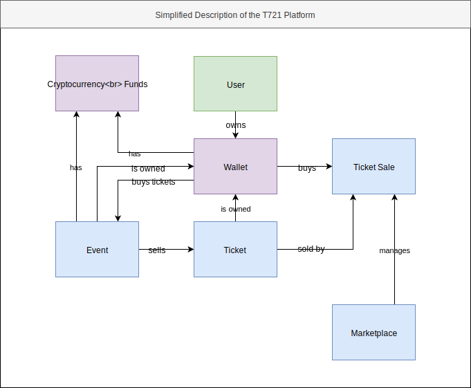

# Software Requirements Specification

     
    
     

| Version | Prepared By | Email |
| :---:   | :---:       | :---: |
| 1.0 | Iulian Rotaru | iulian.rotaru@ticket721.com |

## Document History

| Version | Date | Description | Author |
| :---:   | :---: | :---:      | :---:  |
| 1.0 | 20/07/2019 | Initial Documentation | Iulian Rotaru |

## Table of contents

1. [Introduction](#1_introduction)
   1. [Purpose](#1_1_purpose)
   2. [Scope](#1_2_scope)
   3. [Definitions, acronyms and abbreviations](#1_3_definitions)
   4. [References](#1_4_references)
2. [Overall description](#2_overall_description)
   1. [Product perspective](#2_1_product_perspective)
   2. [Product functions](#2_2_product_functions)
   3. [User characteristics](#2_3_user_characteristics)
   4. [Constraints](#2_4_constraints)
   5. [Assumptions and dependencies](#2_5_assumptions)
3. [Specific requirements](#3_specific_requirements)
   1. [Functional requirements](#3_1_functional_requirements)
      1. [Actor goal list](#3_1_1_actor_goal_list)
      2. [Use case view](#3_1_2_use_case_view)
   2. [Non-functional requirements](#3_2_non_functional_requirements)
      1. [Performance efficiency](#3_2_1_performance)
      2. [Compatibility](#3_2_2_compatibility)
      3. [Usability](#3_2_3_usability)
      4. [Reliability](#3_2_4_reliability)
      5. [Security](#3_2_5_security)
      6. [Maintainability](#3_2_6_maintainability)
      7. [Portability](#3_2_7_portability)
      8. [Design constraints](#3_2_8_design_constraints)
   3. [External interfaces](#3_3_external_interfaces)
4. [Analysis models](#4_analysis_model)

# 1. Introduction

This document will provide an overview of the T721 Platform.

## 1.1. Purpose

An abstract description of the T721 Platform is required as a communication and coordination mean between the technical and non-technical teams. This overview provides enough information for one to understand the Platform and its functions without a deep technical knowledge.

## 1.2. Scope

This document is accessible by all the T721 team. Only technical and product team members might edit its content. The document can be shared to outside parties only under non-divulgation agreement.

## 1.3. Definitions, acronyms and abbreviations

| Abbreviation | Description |
| :---:        | :---:       |
| `api`        | `application public inteface` |
| `T721` | Ticket721 |
| `Wallet` | A User's identity, that technically translates to a secret key owned entirely by the User |
| `T721 User` | User owning a Wallet and using User functions of the platform |
| `T721 Organizer` | User owning a Wallet and using Organizer functions of the platform (there are technically no differences between `T721 User` and `T721 Organizer`, we separate them by their Use Cases` |
| `Dapp` | Decentralized Application (in our case, using the Ethereum Virtual Machine) |

# 2. Overall description

    

## 2.1. Product perspective

    
     

The core functionalities of the platform are handled inside the **T721 Contracts**. They handle all the transactions, create Events, Tickets and Ticket Sales.

On our end, we manage the **T721 Server**, **T721 Server Modules** and **T721 Ethereum Node**. 

The **T721 Server** offers and `api` to `T721 Users` and `T721 Organizers`. This `api` handles data from the Ethereum Blockchain and converts it into database entries. The entries are then queried in a more flexible and useful way into the application.

The **T721 Server Modules** are constantly listening to the Ethereum Blockchain for Events happening to our set of Smart Contracts. One example of Event could be the creation of a Ticket, or a transfer of a Ticket etc ... All these Events are then registered into the database, and served to the `T721 User` and `T721 Organizer` from the **T721 Server**.

The **T721 Ethereum Node** is simply an instance of an Ethereum Client, that communicates witg hundreds / thousands of other clients to intercept and store transactions and actions happening on the Ethereum Blockchain.

Finally, the **T721 WebApp**, **T721 Companion App** and **T721 Scanner App** are interfaces to our platform.

The **T721 WebApp** is an application that serves as a direct communication mean between the **T721 Contracts** and the `T721 User` and `T721 Organizer`. From it, they can create and manage Events, Buy Tickets and sell them back on the Marketplace.

The **T721 Companion App** is a mobile application that helps `T721 Users` store the Tickets they own in an offline manner. The application is able to generate a proof of ownership that is dynamically changing and has the form of a QR Code.

The **T721 Scanner App** is another mobile application that helps `T721 Organizers` check the QR Codes generated by the **T721 Companion App**.

## 2.2. Product Functions

The product provides a web and mobile interface for events to deploy self hosted ticketing solutions. Anyone can deploy an Event under the form of a Smart Contract, that will sell Tickets depending on the rules chosen.

`T721 Users` can then buy these tickets, sell them back or exchange them in an extremelly secured manner, making it impossible to sell or exchange them outside of our platform.

The Marketplace makes the product unique by merging initial and secondary markets into the same platform, and providing a new revenue stream for Event Organizers.

## 2.3. User Characteristics

Two types of services are offered

- The `T721 User` is a user that owns a Wallet (either from a custom wallet provider like Metamask, Status, Opera ...) or uses the T721 Wallet. This type of User will buy tickets from Events, buy and sell tickets from the Marketplace and use the `Companion App` to generated the secured QR Codes. 

- The `T721 Organizer` is a user that owns a Wallet (either from a custom wallet provider like Metamask, Status, Opera ...) or uses the T721 Wallet. This type of User will create and manage Events, and will receive income from the tickets sold by its events, and from its tickets sold on the Marketplace.

## 2.4. Constraints

To use our service, a user does not have to create an account, but should be able to present himself with a valid Wallet. The Wallet will sign transactions and actions and this is how we will handle identity.

## 2.5. Assumption dependencies

Assuming that the system might be under various types of load, it should scale up and down to handle pressure and reduce costs. This includes the `T721 Server` and the `T721 Ethereum Node`.

# 3. Specific requirements

This section contains all requirements in detail: Functional as well as non-functional
requirements (quality attributes and constraints). The quality attributes are listed according
to the ISO/IEC 25010 standard that classifies software quality in a structured set of
characteristics and sub-characteristics.

## 3.1. Functional Requirements

Functional requirements capture the intended behaviour of the Cardea Services.

### 3.1.1. Actor Goal List

There are three types of Users:

- `Unauthenticated User`: A User that hasn't logged in its T721 Account if he uses the T721 Wallet or hasn't authorized our application in its Wallet if he uses a custom Wallet provider.
- `T721 User`: A User that has a Wallet ready to be used for specific use cases.
- `T721 Organizer`: A User that has a Wallet ready to be used for specific use cases that differ from the `T721 User`'s ones.

The `Minter`, `Marketer` and `Approver` are three module types for an Event. Each Event must have one of each in order to work properly. 

- The `Minter` is the module that handles the initial ticket creation rules (sale price, sale end, ticket amount ...)
- The `Marketer` is the module that handles the ticket sales between users.
- The `Approver` is the module that handles the ticket exchanges (outside of the Marketplace)

| Actor | Goal |
| :---: | :---: |
| `Unauthenticated User` | Create T721 Account |
| `Unauthenticated User` | Log In & Use T721 Wallet |
| `Unauthenticated User` | Allow T721 WebApplication & Use Custom Wallet |
| `T721 User` / `T721 Organizer` | Log Out |
| `T721 User` | Search Events |
| `T721 User` | Get Event Details |
| `T721 User` | List Ticket Details of Event |
| `T721 User` | Buy Ticket from Event |
| `T721 User` | Search Owned Tickets |
| `T721 User` | Get Ticket Details |
| `T721 User` | Search Ticket Sales |
| `T721 User` | Open Ticket Sale |
| `T721 User` | Close Ticket Sale |
| `T721 User` | Buy Ticket Sale |
| `T721 Organizer` | Set Event Information |
| `T721 Organizer` | Set Event Minter |
| `T721 Organizer` | Set Event Marketer |
| `T721 Organizer` | Set Event Approver |
| `T721 Organizer` | Deploy Event |
| `T721 Organizer` | Start Event |
| `T721 Organizer` | Edit Event Information |
| `T721 Organizer` | Get Event Funds |
| `T721 Organizer` | Withdraw Event Funds |
| `T721 User` / `T721 Organizer` | Edit Username |

### 3.1.2. Use Case View

    

### List of Use Cases

#### T721 Account (T721AUC)

|  | |
| :---: | :---: |
| Name | Create T721 Account |
| Code | `T721AUC1` |
| Importance | Critical |
| Primary Actor | Unauthenticated User |
| Preconditions | User provides valid credentials |
| Postconditions | New T721 account is created with given credentials, a new Wallet is generated |

|  | |
| :---: | :---: |
| Name | Log In and use T721 Wallet |
| Code | `T721AUC2` |
| Importance | Critical |
| Primary Actor | Unauthenticated User |
| Preconditions | Unauthenticated User provides valid credentials |
| Postconditions | A Token and its encrypted Wallet is sent to the Unauthenticated User |

|  | |
| :---: | :---: |
| Name | Allow T721 WebApp and Use Custom Wallet |
| Code | `T721AUC3` |
| Importance | Critical |
| Primary Actor | Unauthenticated User |
| Preconditions | Unauthenticated User uses a custom Wallet |
| Postconditions | When authorization is given, app uses provided Wallet to connect to Ethereum |

|  | |
| :---: | :---: |
| Name | Log Out |
| Code | `T721AUC3` |
| Importance | Critical |
| Primary Actor | T721 User, T721 Organizer |
| Preconditions | T721 User / Organizer is logged in a T721 Account |
| Postconditions | Previously provided token is unvalidated |

#### T721 Events (T721EUC)

|  | |
| :---: | :---: |
| Name | Search Events |
| Code | `T721EUC1` |
| Importance | Critical |
| Primary Actor | T721 User |
| Preconditions | T721 User has provided a valid Wallet to the app, valid query parameters are provided |
| Postconditions | A List of Events is sent back to the T721 User, depending on the provided query parameters |

|  | |
| :---: | :---: |
| Name | Get Event Details |
| Code | `T721EUC2` |
| Importance | Critical |
| Primary Actor | T721 User |
| Preconditions | T721 User has provided a valid Wallet to the app, Event exists |
| Postconditions | All informations about the Event are sent to the T721 User |

|  | |
| :---: | :---: |
| Name | List Ticket Details of Event |
| Code | `T721EUC3` |
| Importance | Critical |
| Primary Actor | T721 User |
| Preconditions | T721 User has provided a valid Wallet to the app, Event exists |
| Postconditions | All Ticket types information are sent to the T721 User |

#### T721 Tickets (T721TUC)

|  | |
| :---: | :---: |
| Name | Buy Ticket from Event |
| Code | `T721TUC1` |
| Importance | Critical |
| Primary Actor | T721 User |
| Preconditions | T721 User has provided a valid Wallet to the app, T721 User Wallet has enough funds |
| Postconditions | A transaction to buy the specified Ticket is sent by the T721 User Wallet to the Ethereum Blockchain |

|  | |
| :---: | :---: |
| Name | Search Owned Tickets |
| Code | `T721TUC2` |
| Importance | Critical |
| Primary Actor | T721 User |
| Preconditions | T721 User has provided a valid Wallet to the app, valid query parameters are provided |
| Postconditions | A list of owned Tickets is sent to the T721 User, depending on the provided query parameters |

|  | |
| :---: | :---: |
| Name | Get Ticket Details |
| Code | `T721TUC3` |
| Importance | Critical |
| Primary Actor | T721 User |
| Preconditions | T721 User has provided a valid Wallet to the app, valid Ticket is provided |
| Postconditions | All information about the Ticket are sent to the T721 User |

#### T721 Marketplace (T721MUC)

|  | |
| :---: | :---: |
| Name | Search Ticket Sale |
| Code | `T721MUC1` |
| Importance | Critical |
| Primary Actor | T721 User |
| Preconditions | T721 User has provided a valid Wallet to the app, valid query parameters are provided |
| Postconditions | A list of Ticket Sales is sent to the T721 User, depending on the provided query parameters |

|  | |
| :---: | :---: |
| Name | Buy Ticket Sale |
| Code | `T721MUC2` |
| Importance | Critical |
| Primary Actor | T721 User |
| Preconditions | T721 User has provided a valid Wallet to the app, T721 User Wallet has enough funds, Ticket Sale is not created by T721 User |
| Postconditions | A transaction to buy the specified Ticket Sale is sent by the T721 User Wallet to the Ethereum Blockchain |

|  | |
| :---: | :---: |
| Name | Open Ticket Sale |
| Code | `T721MUC3` |
| Importance | Critical |
| Primary Actor | T721 User |
| Preconditions | T721 User has provided a valid Wallet to the app, T721 User Wallet has enough funds, valid Ticket is provided, T721 User owns the Ticket, valid Sale parematers are provided |
| Postconditions | A transaction to open a new Ticket Sale is sent by the T721 User Wallet to the Ethereum Blockchain |

|  | |
| :---: | :---: |
| Name | Close Ticket Sale |
| Code | `T721MUC4` |
| Importance | Critical |
| Primary Actor | T721 User |
| Preconditions | T721 User has provided a valid Wallet to the app, T721 User Wallet has enough funds, Ticket Sale is created by T721 User |
| Postconditions | A transaction to close a Ticket Sale is sent by the T721 User Wallet to the Ethereum Blockchain |

#### T721 Event Creation (T721ECUC)

|  | |
| :---: | :---: |
| Name | Set Event Information |
| Code | `T721ECUC1` |
| Importance | Critical |
| Primary Actor | T721 Organizer |
| Preconditions | T721 Organizer has provided a valid Wallet to the app, valid information is provided by the T721 Organizer |
| Postconditions | Given information is stored in the Event Creation Process |
 
|  | |
| :---: | :---: |
| Name | Set Event Minter |
| Code | `T721ECUC2` |
| Importance | Critical |
| Primary Actor | T721 Organizer |
| Preconditions | T721 Organizer has provided a valid Wallet to the app, valid Minter is selected, valid Minter parameters are provided |
| Postconditions | Given Minter and parameters are stored in the Event Creation Process |

|  | |
| :---: | :---: |
| Name | Set Event Marketer |
| Code | `T721ECUC3` |
| Importance | Critical |
| Primary Actor | T721 Organizer |
| Preconditions | T721 Organizer has provided a valid Wallet to the app, valid Marketer is selected, valid Marketer parameters are provided |
| Postconditions | Given Marketer and parameters are stored in the Event Creation Process |

|  | |
| :---: | :---: |
| Name | Set Event Approver |
| Code | `T721ECUC4` |
| Importance | Critical |
| Primary Actor | T721 Organizer |
| Preconditions | T721 Organizer has provided a valid Wallet to the app, valid Approver is selected, valid Approver parameters are provided |
| Postconditions | Given Approver and parameters are stored in the Event Creation Process |

|  | |
| :---: | :---: |
| Name | Deploy Event |
| Code | `T721ECUC5` |
| Importance | Critical |
| Primary Actor | T721 Organizer |
| Preconditions | T721 Organizer has provided a valid Wallet to the app, T721 Organizer Wallet has enough funds, valid informations is provided, valid Minter is selected and configured, valid Marketer is selected and configured, valid Approver is selected and configured |
| Postconditions | A transaction to deploy a new Event is sent by the T721 Organizer Wallet to the Ethereum Blockchain |

|  | |
| :---: | :---: |
| Name | Start Event |
| Code | `T721ECUC6` |
| Importance | Critical |
| Primary Actor | T721 Organizer |
| Preconditions | T721 Organizer has provided a valid Wallet to the app, T721 Organizer Wallet has enough funds, T721 Organizer is owner of Event |
| Postconditions | A transaction to start the Event is sent by the T721 Organizer Wallet to the Ethereum Blockchain |

#### T721 Event Management (T721EMUC)

|  | |
| :---: | :---: |
| Name | Edit Event Information |
| Code | `T721EMUC1` |
| Importance | Critical |
| Primary Actor | T721 Organizer |
| Preconditions | T721 Organizer has provided a valid Wallet to the app, valid information is provided, T721 Organizer is owner of Event, valid Wallet signature is provided |
| Postconditions | Event information is modified |

|  | |
| :---: | :---: |
| Name | Get Event Funds |
| Code | `T721EMUC2` |
| Importance | Critical |
| Primary Actor | T721 Organizer |
| Preconditions | T721 Organizer has provided a valid Wallet to the app, valid information is provided |
| Postconditions | Current Event balance value is sent to the T721 Organizer |

|  | |
| :---: | :---: |
| Name | Withdraw Event Funds |
| Code | `T721EMUC3` |
| Importance | Critical |
| Primary Actor | T721 Organizer |
| Preconditions | T721 Organizer has provided a valid Wallet to the app, T721 Organizer is owner of Event |
| Postconditions | A transaction to withdraw the Event Funds is sent by the T721 Organizer Wallet to the Ethereum Blockchain |

#### T721 Settings (T721SUC)

|  | |
| :---: | :---: |
| Name | Edit Username |
| Code | `T721SUC1` |
| Importance | Critical |
| Primary Actor | T721 User, T721 Organizer |
| Preconditions | T721 User / Organizer has provided a valid Wallet to the app, T721 User / Organizer has provided a valid signature of the new username |
| Postconditions | The username is modified |

## 3.2. Non-Functional Requirements

### 3.2.1. Performance efficiency

The `T721 Server`, `T721 Database` and `T721 Ethereum Node` should be able to scale properly.

### 3.2.2. Compatibility

The platform uses the ERC721 (NFT) protocol to create and operate tickets. Any external service can plus itself to our contracts and interact with the tickets.

### 3.2.3. Usability

The `T721 WebApp` should be usable on Desktop and Mobile. The `T721 Companion` and `T721 Scanner` should be usable on iOS and Android devices.

### 3.2.4. Reliability

The `T721 Platform` handles the transactions that are sent to the Ethereum Blockchain. As soon as the transaction leaves the Platform to go on the Blockchain, it is not our reponsibility to make it proceed.
Event if our platform is shut down, our database is compromised and erased, all the Events and Tickets should still exist.

### 3.2.5. Security

The T721 Wallet is stored in an encrypted manner on our `T721 Database`.

### 3.3.6. Portability

No specific portability requirements.

### 3.2.7. Design Constraints

The main goal of the T721 Platform is to think UX before anything else and provide an easy to use interface to our `T721 Contracts`.

## 3.3. External interfaces

### Graphical External Interfaces

- **T721 WebApp** is a web application that communicates both with the Ethereum Blockchain and the `T721 Server`. Most use cases happend through it.
- **T721 Companion** is a mobile application that stores Tickets in an offline manner and is able to generate signed QR Codes.
- **T721 Scanner** is a mobile application that is able to verify the signed QR Codes. 

### Non-graphical Interfaces

- **T721 Server** exposes an `api` used by the **T721 WebApp**, **T721 Companion** and **T721 Scanner**.
- **T721 Contracts** exposes read-only methods and helpers.

# 4. Analysis Model

    

